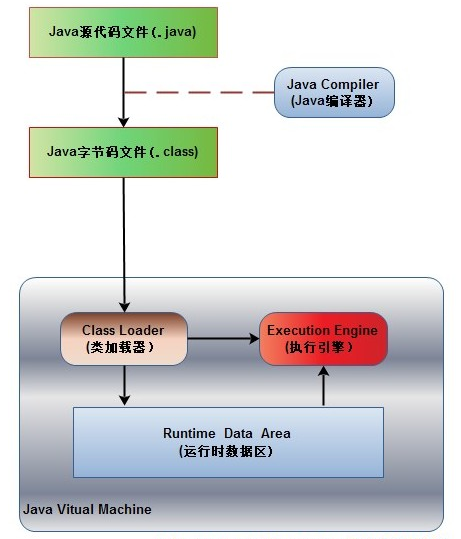

<!-- TOC -->

- [1. java 跨平台性的实现](#1-java-跨平台性的实现)
- [2. JDK, JRE 和 JVM 的概述](#2-jdk-jre-和-jvm-的概述)
- [3. java 编译运行机制](#3-java-编译运行机制)
- [4. 环境变量](#4-环境变量)
  - [4.1. CLASSPATH](#41-classpath)
  - [4.2. JAVA_HOME](#42-java_home)
  - [4.3. PATH](#43-path)
- [5. java 编写要求](#5-java-编写要求)
- [6. java 的注释](#6-java-的注释)
- [7. java 命名规范](#7-java-命名规范)
- [8. 关键字和保留字](#8-关键字和保留字)
- [9. java 语言分隔符](#9-java-语言分隔符)

<!-- /TOC -->

## 1. java 跨平台性的实现
- 通过编写源代码, 然后 javac 将其编译成字节码文件   
  然后由 JVM 识别并运行
- JVM 是 Java 虚拟机, Java 虚拟机用于识别字节码文件  
- 字节码文件与平台无关, 不同平台的 JVM 都可以识别  
- JVM 是不跨平台的, 不同平台有不同版本

## 2. JDK, JRE 和 JVM 的概述
- JDK:  
  JDK 全称 Java SE Development kit(JDK), 即 java 标准版开发包,  
  是 Oracle 提供的一套用于开发 java 应用程序的开发包,  
  它提供编译, 运行java程序所需要的各种工具和资源,  
  包括java编译器, java运行时环境, 以及常用的java类库等.
- JRE:  
  全称 Java Runtime Environment, 即 java 运行环境  
  如果需要运行 java 程序, 就需要 JRE 支持, JRE 包含 JVM.
- JVM:   
  全称 Java Virtual Machine, 是运行所有 java 程序的虚拟计算机,  
  JVM 是 java 语言的运行环境, 用于读取并处理编译过的字节码文件,     
  从而实现 java 的可移植性.

## 3. java 编译运行机制
1. 编写源文件
2. javac 工具对源文件进行编译, 生成字节码文件,  
  文件名是所编写的每个源文件的类名加后缀 .class  
3. 然后通过启动 JVM 并执行字节码文件

## 4. 环境变量

### 4.1. CLASSPATH
- CLASSPATH 是 class 文件的路径, 指引 JVM 找 class 文件的位置.  
- 从 java5 开始 CLASSPATH 默认就是当前路径, 一般情况下不需要再指定.

### 4.2. JAVA_HOME 
- 指 JDK 的安装根目录

### 4.3. PATH
- 指 java 开发工具的位置

## 5. java 编写要求
1. java 严格区分大小写  
   
2. 一个 java 源文件里可以定义多个 java 类,  
但其中最多只能有一个类被定义为 public 类,  
若源文件中包含了 public 类, 源文件必须和该 pubic 类同名.  

3. 一个源文件中包含 n 个 java 类时, 编译后会生成 n 份字节码文件,  
即每个类都会生成一份单独的 class 文件, 且字节码文件名和其对应的类名相同.  

4. 一个类必须拥有 main 方法才能运行, 因为 main 方法是程序的入口.  
   
5. **备注:**   
C++ 中对类没有权限设置, C++ 中只对类内部方法和变量有权限设置  
java 中对类有权限设置, 且一个源文件中仅可以出现一个 public 类.

## 6. java 的注释
- java 中有三种注释类型   
- 第一种: `//`    
单行注释: 快捷键Ctrl+/    再次按撤销注释    
一般用来注释局部变量

- 第二种: `/* */`     
多行注释: Ctrl+shift+/   撤销操作: Ctrl+shift+\   
可用来注释文件头/算法实现/方法中的复杂代码块/修改记录

- 第三种: `/** */`    
文档注释: shift+alt+j     
可用来注释类/接口/静态方法/成员方法/静态变量/成员变量/常量    
或者在定义完注释类/接口/静态方法/成员方法/静态变量/成员变量/常量后,  
在上面加上 /** 再按 Enter 也能生成   

## 7. java 命名规范
1. 项目名全部小写
2. 包名全部小写
3. 类名首字母大写，若类名由多个单词构成，每个单词首字母大写，即驼峰命名法
4. 变量名/方法名首字母小写，若其由多个单词构成，  
   第一个单词后每个单词首字母大写，即小驼峰命名法
5. 常量名全部大写
6. 以上所有命名遵循规则：  
   1. 名称只能由数字/字母/下划线/$符组成   
   2. 不能以数字开头
   3. 不能是有 java 的关键字和保留字 (下节主要属性关键字和保留字)  
   4. 严禁使用汉字和拼音
   5. 不能使用 java API 中的类名作为自己的类名

## 8. 关键字和保留字
- 关键字: 在编程语言中有一些事先定义的, 有特殊含义和用途的单词.  
- 保留字: 和关键字一样都是编程语言事先定义好的, 只是目前暂时没有特殊的用途, 留给以后备用.
- 注: java 无 sizeof/goto/const 关键字

## 9. java 语言分隔符
- 分号(;) 语句的分割, 表示一行结束
- 花括号({}) 表示一个代码块, 是一个整体, 成对使用
- 方括号([]) 定义数组和访问数组元素时使用
- 圆括号(()) 很多情况下都在使用, 具体情况具体分析
- 圆点(.) 类和对象访问它的成员的时候使用
- 空格( ) 把一整条语句分割成几段
  
