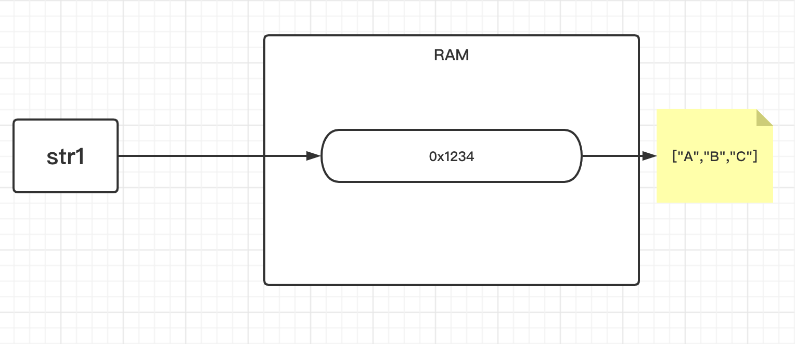
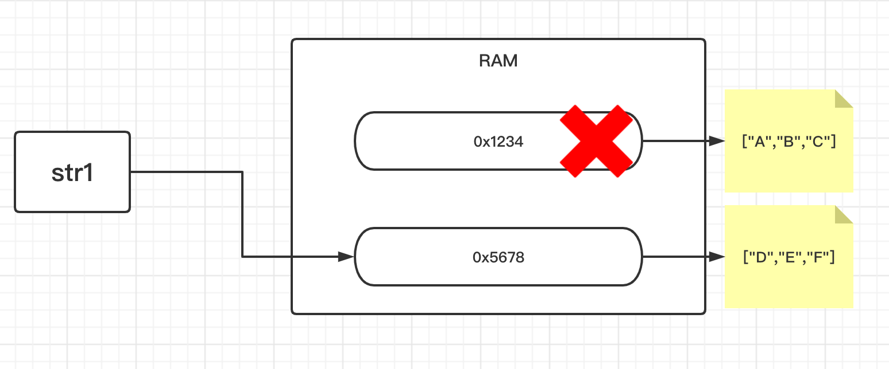
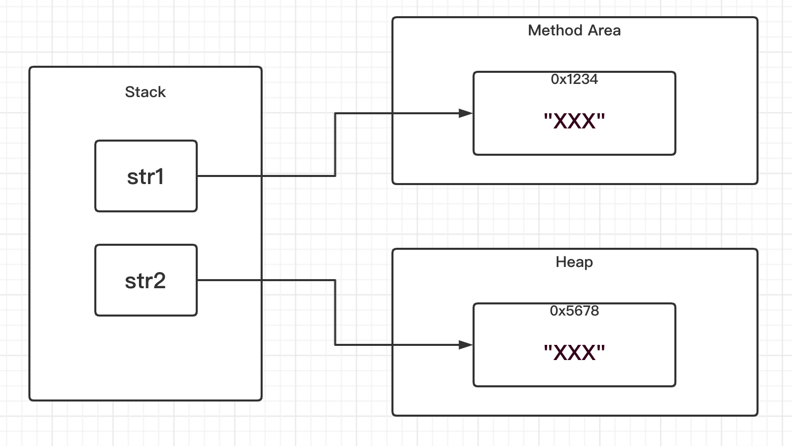
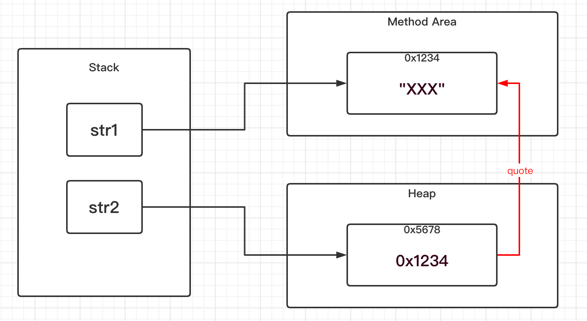

<!-- TOC -->

- [1. 常用类_字符串相关类(java.lang)](#1-常用类_字符串相关类javalang)
  - [1.1. 字符串概述和分类](#11-字符串概述和分类)
    - [1.1.1. 字符串的概念](#111-字符串的概念)
    - [1.1.2. 字符串的分类](#112-字符串的分类)
    - [1.1.3. 字符串的本质](#113-字符串的本质)
  - [1.2. String 类](#12-string-类)
    - [1.2.1. String 类的存储解释](#121-string-类的存储解释)
    - [1.2.2. String 对象的创建](#122-string-对象的创建)
    - [1.2.3. String 对象两种创建方式的区别](#123-string-对象两种创建方式的区别)
    - [1.2.4. String 对象的空值](#124-string-对象的空值)
    - [1.2.5. 判断字符串非空](#125-判断字符串非空)
    - [1.2.6. 字符串的比较操作](#126-字符串的比较操作)
    - [1.2.7. 字符串相等经典例题](#127-字符串相等经典例题)

<!-- /TOC -->

## 1. 常用类_字符串相关类(java.lang)
- 在 java.lang 中能找到一下类.
- 与字符串相关的类中最常用的有以下三个:  
  - String 类
  - StringBuilder 类
  - StringBuffer 类

### 1.1. 字符串概述和分类

#### 1.1.1. 字符串的概念 
- 字符串也叫字符序列, 是把多个字符按照一定的顺序排列起来的形式.  

#### 1.1.2. 字符串的分类  
- 不可变的字符串:   
  String 类的字符串. 其特征为当对象创建完毕后, 该对象的内容,  
  即字符序列是不能发生改变的, 一旦内容改变就会是一个新的对象,  
  因为指向了新的字符串的内存地址空间, 旧的字符串的地址不再指向.

- 可改变的字符串:  
  StringBuilder/StringBuffer 类的字符串.  
  当对象创建完毕之后, 该对象的内容可以发生改变,  
  当内容发生改变的时候, 对象保持不变.

#### 1.1.3. 字符串的本质
- `String` 类的底层其实是调用的 `char` 数组,  
  是对 `char` 数组的一些操作方法的封装.

- 因此 `String` 类对象实际上等同于一个 `char` 类型的数组.

****

### 1.2. String 类
- 不可变的字符串, 内容不可改变. 

#### 1.2.1. String 类的存储解释
- 如下, 创建一个 `String` 类对象并对其进行操作.
  
```java
String str1 = "ABC";// 创建对象
System.out.println(str1); //输出内容为 ABC

str1 = "DEF";//改变值
System.out.println(str1); //输出内容为 DEF
```

- 在这个过程中字符串表面上并没有发生改变, 实际上在内存中它的地址指向发生改变.

- 由于 `String` 类对象等同于 `char` 类型数组, 因为底层进行了封装.  
  因此可以得出如下示意图中的内容:  
  

- 然后字符串内容发生改变之后, 相当于指向了新的 `char` 数组的内存地址.  
  改过程的本质类似于引用传值的原理.  
  

#### 1.2.2. String 对象的创建
- 创建字符串对象有两种方式:  
  以下两种方式在内存分布中存在着区别.
  
  - 第一种是直接赋值字面量:  
    ```java
    String str1 = "xxx";
    ```
  
  - 第二种是通过构造器创建:  
    ```java
    String str2 = new String("xxx");
    ```

#### 1.2.3. String 对象两种创建方式的区别  
- 直接赋值字面量的方式会在方法区的常量池中分配区域用于存储数据.  
- 通过构造器创建的方式则会在堆空间中分配内存区域用于存储数据.

```java
String str1 = "xxx";
String str2 = new String("xxx");
```


- 然而由于在构建 `str2` 对象时会先从方法区中的常量池进行寻找,  
  寻找是否存在 `"XXX"` 这个对象, 如果存在则直接引用它的地址即可.  

- 但如果用 `==` 进行比较是会得到 `false` 的结果, 因为比较的是内存地址.
  


**两种方法的区别总结如下**:  
  
- 直接字面量赋值的方式:  
  - 会先在常量池寻找是否存在相对应的 String 对象.  
    - 如果存在, 则直接引用地址, 此时并不会创建 String 对象;
    - 如果不存在, 则先在常量池创建对象, 再引用地址空间,  
        此时创建了一个 String 对象.  
  
  - 因此该方法最少不会创建对象, 最多会创建一个对象.

- 通过构造器创建的方式:  
  
  - 也会先在常量池中寻找是否存在相对应的 String 对象.  
    - 如果存在, 则先在堆中创建一个对象, 因为使用了构造器, 必须生成对象.  
        然后通过这个对象去引用常量池中的对象的地址, 此时创建了一个对象.
    - 如果不存在, 则先在常量池中创建一个对象, 然后再在堆中创建对象,  
        在堆中创建的对象会引用常量池中的对象的地址, 此时创建了两个对象.
  
  - 因此该方法至少创建一个对象, 最多创建两个对象.


****

#### 1.2.4. String 对象的空值
- 表示引用为空(`null`):  
  这种情况表示没有初始化, 没有分配内存空间.
  ```java
  String str1 = null;
  ```

- 表示字符序列为空字符串(`""`):  
  这种情况表示已经初始化, 且分配了内存空间, 但内存空间中并没有数据.
  ```java
  String str2 = "";
  ```

#### 1.2.5. 判断字符串非空
- 引用不能为空
- 字符串内容不能为空字符串

#### 1.2.6. 字符串的比较操作
- 使用 `==` 号运算符:  
  这种方式比较的是引用的内存地址是否相同, 相同为 true.  
  ```java
  String str1 = "ABC";
  String str2 = str1;
  String str3 = "ABC";

  boolean isTrue1 = (str1 == str2); 
  boolean isTrue2 = (str1 == str3); 
  
  System.out.println(isTrue1);//输出结果 true
  System.out.println(isTrue2);//输出结果 true
  ```

- 使用 `equals` 方法:  
  - 这种方法比较的是字符串的值是否一致.  
  
  - 在 `String` 类中对 `Object` 类的 `equals` 方法进行了覆写.  
    会先对两个对象的内存地址进行比较, 如果内存地址不一样,  
    再对字符串的值进行比较. 两者满足其一则为 true.
  
  - 在对字符串的值进行比较的时候, 实际上是对其底层 char 数组的中的  
    每一个元素逐个进行匹配比较是否值是相等.
    ```java
    String str1 = new String("ABC");
    String str2 = new String("ABC");
    
    boolean isTrue1 = (str1 == str2); 
    System.out.println(isTrue1);//输出结果为 false
    
    boolean isTrue2 = str1.equals(str2); 
    System.out.println(isTrue2);//输出结果为 true
    ```

#### 1.2.7. 字符串相等经典例题
- 题目:  
  说说下面的 String 对象彼此之间是否相等.  

- 结果:  
  在下面的代码注释中给出.

```java

private static String getXx(){
    return "AB";
}

public static void main(String args[]){
    String str1 = "ABCD";
    
    String str2 = "A" + "B" + "C" + "D";
    
    String str3 = "AB" + "CD";
    
    String str4 = new String("ABCD");
    
    String temp = "AB";
    String str5 = temp + "CD";
    
    String str6 = getXx() + "CD";


    System.out.println(str1 == str2);//true
    System.out.println(str1 == str3);//true
    System.out.println(str1 == str4);//false
    System.out.println(str1 == str5);//false
    System.out.println(str1 == str6);//false
}

```

- **针对前三个字符串 `str1, str2, str3` 相等的解释:**  
  - 在编译中存在着编译优化的问题.   
    反编译后可以看出优化过后它们指向的是常量池中同一个对象.
  
  - 因此通过包含直接量的字符串进行字符连接是在编译时期就所能够决定的,  
    可以在编译的时候确定是否有该直接量的拼接结果的字符串存在于常量池当中,  
    所以可以通过编译优化来减少内存的占用.

  - 实际编译如下:  
  ```java
  String str1 = "ABCD";
  String str2 = "ABCD";
  String str3 = "ABCD";
  ```

- **针对 `str4` 不相等给出的解释:**  
  - `==` 比较的是内存地址, 显然 `str1` 与 `str4` 的内存地址并不相同.

- **针对 `str5, str6` 不相等给出的解释:**  
  - 反编译后可以看出 `str5, str6` 分别创建了两个不同的 `StringBuilder` 对象,  
    然后两个对象再进行字符串拼接, 最后再转化为 `String` 类型的对象.  
    同时 `(str5 == str6)` 的结果也是 `false`, 因为是两个不同的对象.
    
  - 因此通过变量/方法去连接字符串, 都只能在运行时期才能确定变量的值或返回的方法值,  
    所以是不存在编译优化的问题.
  
  - 实际编译效果如下:
  ```java
  String str5 = (new StringBuilder(String.valueOf(temp))).append("CD").toString();
  String str6 = (new StringBuilder(String.valueOf(getXx()))).append("CD").toString();
  ```