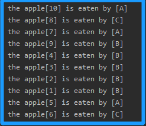
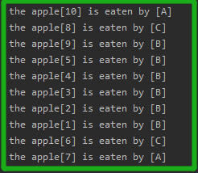

<!-- TOC -->

- [1. JAVA 操作线程](#1-java-操作线程)
  - [1.1. 继承 Thread 类创建线程](#11-继承-thread-类创建线程)
    - [1.1.1. 创建线程步骤](#111-创建线程步骤)
    - [1.1.2. 创建线程实例](#112-创建线程实例)
  - [1.2. 实现 Runnable 接口创建线程](#12-实现-runnable-接口创建线程)
    - [1.2.1. 创建线程步骤](#121-创建线程步骤)
    - [1.2.2. 创建线程实例](#122-创建线程实例)
  - [1.3. 使用匿名内部类来创建线程](#13-使用匿名内部类来创建线程)
    - [1.3.1. 用接口形式的匿名内部类](#131-用接口形式的匿名内部类)
    - [1.3.2. 用类形式的匿名内部类](#132-用类形式的匿名内部类)
- [2. 创建线程的案例分析](#2-创建线程的案例分析)
  - [2.1. 案例描述和解决](#21-案例描述和解决)
    - [2.1.1. 继承 Thread 类来解决](#211-继承-thread-类来解决)
    - [2.1.2. 实现 Runnable 接口来解决](#212-实现-runnable-接口来解决)
- [3. 继承方式和实现方式之间的区别](#3-继承方式和实现方式之间的区别)
  - [3.1. 区别分析](#31-区别分析)
    - [3.1.1. 继承方式](#311-继承方式)
    - [3.1.2. 实现方式](#312-实现方式)

<!-- /TOC -->

## 1. JAVA 操作线程
- 创建和启动线程, 有两种传统的方式:  
  - 方式1: 继承 Thread 类(`java.lang.Thread`)
  - 方式2: 实现 Runnable 接口(`java.lang`)

- 在程序中, `main` 方法运行时表示为主线程.  
- 因此多线程就是在主线程中创建多个线程进行运行.

### 1.1. 继承 Thread 类创建线程
- Thread 类及其子类才能称之为线程类.

#### 1.1.1. 创建线程步骤
- 定义一个类(假设类名为 `Test`), 继承于 `java.lang.Thread` 类;

- 在类 `Test` 中覆盖 `Thread` 类中的 `run` 方法;
  ```java
  class Test extends Thread {
         //Other Functions and Variables...
         @override
         public void run() {
             //TODO...
         }
  }
  ```

- 在 `run` 方法中编写需要执行的操作,  
  `run` 方法中的代码被称之为线程执行体.  

- 在 `main` 方法(主线程)中, 创建线程对象, 并启动线程.  

- 启动线程的方式如下所示:  
  ```java
  //创建线程类对象
  Test t = new Test();
  //调用线程对象的 start 方法
  t.start();
  ```

- 注意:  
  不能用线程对象直接调用 `run` 方法, 这样调用相当于对象调用方法,  
  结果依旧是只有原来的线程, 并不会开启/增加新的线程.  
  因此只有用 `start` 方法才会产生新线程, 同时它会在底层调用 `run` 方法.

#### 1.1.2. 创建线程实例
- 创建一个一边听歌一边看视频的程序.

- 创建线程类, 用来听歌的.  
  ```java
  class MusicThread extends Thread {
         MusicThread() {
         }
 
         public void run() {
             //Listen Music
             //TODO...
             for(int i = 0; i < 10; i++){
               System.out.println("Music");
             }
         }
  }
  ```

- 然后在主线程(假设主线程视频)创建并启动线程:  
  ```java
  public static void main(String[] args){
    for(int i = 0; i < 10; i++){
      System.out.println("Video");
      
      //假设主线程执行中途开始并发新线程
      //两个线程开始抢占资源
      if(i == 5){
        MusicThread m = new MusicThread();
        m.start();
      }
    }
  }
  ```

- 输出结果如下(理想状态: 每个线程抢一次资源):  
  实际情况每次执行都不一样, 线程的随机性.  
  ```
  Video
  Video
  Video
  Video
  Video
  Music
  Video
  Music
  Video
  Music
  Video
  Music
  Video
  Music
  Video
  Music
  Music
  Music
  Music
  Music
  ```

### 1.2. 实现 Runnable 接口创建线程

#### 1.2.1. 创建线程步骤
- 自定义类 `Test` 实现 `Runnable` 接口.

- 覆盖接口中的 `run` 方法, 线程运行的代码放在 `run` 中.
  ```java
  class Test implements Runnable{
    @override
    public void run(){
      //TODO...
    }
  } 
  ```

- 通过 `Thread` 类创建线程对象, 并将实现了 `Runnable` 接口的  
  实现类对象作为参数传递给 `Thread` 类的构造器.

- `Thread` 类对象调用 `start` 方法, 启动线程.  
  自定义实现类并不是线程类, 因此只能通过这种方式去调用 `start` 方法创建线程.
  ```java
  Thread t = new Thread(new Test());
  t.start();
  ```

#### 1.2.2. 创建线程实例
- 创建一个一边听歌一边看视频的程序.

- 创建接口实现类  
  ```java
  class MusicRunnableImp implements Runnable{
         MusicThread() {
         }
 
         @override
         public void run() {
             //Listen Music
             //TODO...
             for(int i = 0; i < 10; i++){
               System.out.println("Music");
             }
         }
  }
  ```

- 然后在主线程(假设主线程视频)创建并启动线程:  
  ```java
  public static void main(String[] args){
    for(int i = 0; i < 10; i++){
      System.out.println("Video");
      
      //假设主线程执行中途开始并发新线程
      //两个线程开始抢占资源
      if(i == 5){
        Thread t = new Thread(new MusicRunnableImp());
        t.start();
      }
    }
  }
  ```

### 1.3. 使用匿名内部类来创建线程
- 匿名内部类只适用于某一个类只使用一次的情况

#### 1.3.1. 用接口形式的匿名内部类
```java
public static void main(String[] args){
  for(int i = 0; i < 10; i++){
    System.out.println("Video");
    
    if(i == 5){
      //用接口形式的匿名内部类进行创建线程
      new Thread(new Runnable(){
        public void run(){
          //TODO...
        }
      }).start();
    }
  }
}
```

#### 1.3.2. 用类形式的匿名内部类
```java
public static void main(String[] args){
  for(int i = 0; i < 10; i++){
    System.out.println("Video");
    
    if(i == 5){
      //用类形式的匿名内部类进行创建线程
      new Thread(){
        public void run(){
          //TODO...
        }
      }.start();
    }
  }
}
```

## 2. 创建线程的案例分析
- 通过案例对通过继承 `Thread` 类和通过实现 `Runnable` 接口  
  这两种创建线程的方式进行分析并比较之间的区别.

### 2.1. 案例描述和解决
  
- 问题描述:  
  存在 50 个苹果, 请 3 个人, A, B, C 进行表演吃苹果.  
  因为 A, B, C 三个人可以同时吃苹果, 需要使用多线程来实现.

- 问题分析:  
  可以定义三个线程对象, 并启动线程. 每个人吃的时候先报出苹果的编号,  
  然后再吃掉苹果, 每吃一个苹果的总数减一.

- 解决方案:  
  - 可以使用继承 `Thread` 方式来实现.  
  - 可以使用实现 `Runnable` 方式来实现.

****

#### 2.1.1. 继承 Thread 类来解决
```java
//创建人物线程, 每一个同学相当于一个线程对象
class Person extends Thread{
  //苹果总数
  private static int apple_num = 50;
  public Person(){

  }
  public Person(String name){
    super(name);
  }

  public void run(){
    while(apple_num > 0){
      System.out.printf("the apple[%d] is eaten by [%s]", apple_num --, super.getName());
    }
  }
}

public class Test{
  public void main(String[] args){
    new Person("A").start();
    new Person("B").start();
    new Person("C").start();
  }
}
```
- 注意:  
  这里的继承类中的苹果数量定义为静态变量.

- 将苹果数量设置为 10(便于截图)的结果:  
  

****

#### 2.1.2. 实现 Runnable 接口来解决
```java
class Apple implements Runnable {
    private int apple_num = 10;

    public void run() {
        while (apple_num > 0) {
            //通过 Thread.currentThread() 方法获取当前执行线程的引用
            System.out.printf("the apple[%d] is eaten by [%s]\n", apple_num--, Thread.currentThread().getName());
        }
    }
}

public class Test {
    public static void main(String[] args) {
        Apple a = new Apple();
        new Thread(a, "A").start();
        new Thread(a, "B").start();
        new Thread(a, "C").start();
    }
}

```
- 注意:  
  这里的实现类中的苹果数量是定义为非静态.

- 将苹果数量设置为 10(便于截图)的结果:  
  
  

## 3. 继承方式和实现方式之间的区别
- 通过上述案例来进行深入分析

### 3.1. 区别分析

#### 3.1.1. 继承方式  
- JAVA 中类是单继承的, 如果继承了 `Thread` 类, 该类就不能再有其它直接父类.  

- 从操作上来看, 继承方式比较简单, 获取线程名字也方便.   
  从这一点来看, 继承方式操作更简单.

- 从只考虑实例成员变量以及多线程共享资源的角度来看, 继承方式并不能共享资源.  
  因为需要在继承的子类中对变量定义为静态变量, 但这样线程不安全(后续有详解).

#### 3.1.2. 实现方式  
- JAVA 中类可以实现多接口, 此时该类还可以继承其它类, 并且实现其它接口.  
  从这一点来看, 实现方式设计更优雅. 

- 从操作上来看, 实现方式略为复杂, 获取线程名字需要通过调用 `Thread` 类中的方法.

- 从只考虑实例成员变量以及多线程共享资源的角度来看, 实现方式能很好的共享资源.  
  因此当需要资源共享的时候, 用实现方式去多线程比较合理.