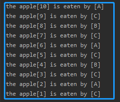

<!-- TOC -->

- [1. 线程同步的方式](#1-线程同步的方式)
  - [1.1. 同步代码块](#11-同步代码块)
    - [1.1.1. 语法](#111-语法)
    - [1.1.2. 同步锁的概念](#112-同步锁的概念)
    - [1.1.3. 同步代码块实例](#113-同步代码块实例)
    - [1.1.4. 注意事项](#114-注意事项)
  - [1.2. 同步方法](#12-同步方法)
    - [1.2.1. 语法](#121-语法)
    - [1.2.2. 同步方法中的同步锁](#122-同步方法中的同步锁)
    - [1.2.3. 同步方法的实例](#123-同步方法的实例)
    - [1.2.4. 注意事项](#124-注意事项)
- [2. synchronized 归纳](#2-synchronized-归纳)
    - [2.1. synchronized 的优缺点](#21-synchronized-的优缺点)
    - [2.2. 懒加载同步的优化](#22-懒加载同步的优化)

<!-- /TOC -->

## 1. 线程同步的方式
有三种保证线程同步的方法:  
- 同步代码块
- 同步方法
- 锁机制(Lock)

### 1.1. 同步代码块

#### 1.1.1. 语法
```java
synchronized(/*LOCK*/){
  //TODO...
}
```

#### 1.1.2. 同步锁的概念
- 为了保证每个线程都能正常执行原子操作, JAVA 引入了线程同步机制.  

- 同步锁也称为同步监听对象/同步监听器/互斥锁.  

- 对象的同步锁只是一个概念, 可以想象为在对象上标记了一个锁.  

- JAVA 程序允许把任何对象作为同步监听对象, 但一般来说,  
  会去选择当前并发访问的共同资源作为同步监听对象.  

- 注意:  
  在任何时候最多允许一个线程拥有同步锁.  
  哪个线程拿到了锁哪个线程就进入代码块,  
  然后对要求同步的资源进行修改,  
  其余线程只能等待.

#### 1.1.3. 同步代码块实例
- 代码根据之前的苹果案例进行修改
  ```java
  class Apple implements Runnable {
      private int apple_num = 10;

      public void run() {
          while (true) {
              //在堆数据进行操作的部分加入同步代码块
              synchronized (this) {
                  if (apple_num > 0) {
                      try {
                          //延迟设置为0
                          Thread.sleep(0);
                      } catch (Exception ex) {
                          ex.printStackTrace();
                      }
                      System.out.printf("the apple[%d] is eaten by [%s]\n", apple_num--, Thread.currentThread().getName());
                  } else break;
              }
          }
      }
  }

  public class Test {
      public static void main(String[] args) {
          Apple a = new Apple();
          new Thread(a, "A").start();
          new Thread(a, "B").start();
          new Thread(a, "C").start();
      }
  }
  ```

- 运行结果:  
  

#### 1.1.4. 注意事项
- 切忌不能将循环放入代码块中, 否则抢到资源的线程将会占满整个循环.  
  因为循环是在代码块当中, 而同步代码块就是用于线程执行完后其它线程才能执行.

- 同时要在同步代码块中加入总数的非零判断, 如果在同步代码块之外放置,  
  就会出现在总数为 1 的瞬间, 三个线程都能判定有资格执行同步代码块,  
  而此时数据还未被修改, 所以最终会输出 0 和负数结果.

### 1.2. 同步方法
- 使用 `synchronized` 修饰的方法就叫同步方法.  
- 保证了 A 线程执行该方法的时候, 其他线程不能对资源进行修改.  

#### 1.2.1. 语法
```java
synchronized function(para){
  //TODO...
}
```

#### 1.2.2. 同步方法中的同步锁
- 对于非静态方法, 同步锁就是 `this` 即当前调用方法的对象.
- 对于静态方法, 同步锁则是当前方法所在类的字节码对象.

#### 1.2.3. 同步方法的实例
```java
class Apple implements Runnable {
    private int apple_num = 10;

    public void run() {
        while (true) {
            eatApple();
            if (apple_num <= 0) break;
        }
    }

    synchronized public void eatApple() {
        try {
            Thread.sleep(10);
        } catch (Exception ex) {
            ex.printStackTrace();
        }
        System.out.printf("the apple[%d] is eaten by [%s]\n", apple_num--, Thread.currentThread().getName());
    }
}

public class Test {
    public static void main(String[] args) {
        Apple a = new Apple();
        new Thread(a, "A").start();
        new Thread(a, "B").start();
        new Thread(a, "C").start();
    }
}
```

#### 1.2.4. 注意事项
- `synchronized` 不能修饰 `run` 方法, 否则也会导致单一线程执行完所有功能,  
  最终导致其它线程闲置, 不能达到多线程的效果.

- 需要注意非零判断的位置.


## 2. synchronized 归纳

#### 2.1. synchronized 的优缺点
- 优点:  
  保证了多线程并发访问时的同步操作, 避免线程的安全问题.
- 缺点:  
  使用 `synchronized` 修饰的代码块/方法更加耗费性能.

- 实例:  
  - `StringBuilder` 和 `StringBuffer` 间的区别就在于有无使用 `synchronized` 修饰.  
    后者使用了同步修饰, 因此性能没有前者高, 但是线程安全.
  
  - `ArrayList` 和 `Vector` / `HashMap` 和 `HashTable` 的区别也如上.  
    后者都使用了同步修饰, 因此性能没有前者高, 但是线程安全.

- 建议:  
  减少 `synchronized` 修饰的作用域.

#### 2.2. 懒加载同步的优化
- 设计一个单例模式的工具类, 如下所示:  
  ```java
  public class TestUtils{
    //将构造方法私有化
    private TestUtils() {

    }
    //定义一个静态成员用以接受类实例化成员
    private TestUtils instance = null;

    //定义一个公共方法来让外部获取单例, 该方法必须用同步修饰
    synchronized public static TestUtils getInstance() {
      if(instance == null){
        instance = new TestUtils();
      }
      return instance;
    }

    //定义一个示例的工具方法
    public void sortArr(int[] arr) {
      //TODO...
    }
  }
  ```

- 返回单例的方法必须用 `synchronized` 修饰, 用以保证线程安全.  
  重点是能用来保证工具类始终只实例化了一个成员并返回它的引用.  
  这样始终能让该工具类始终是单例.

- 此时同步箭头的对象是该类的字节码文件, 即 `TestUtils.class`

- 由于上述代码 `synchronized` 修饰的范围过大, 可以继续进行优化.  
  解决方案是使用双重检查锁机制.