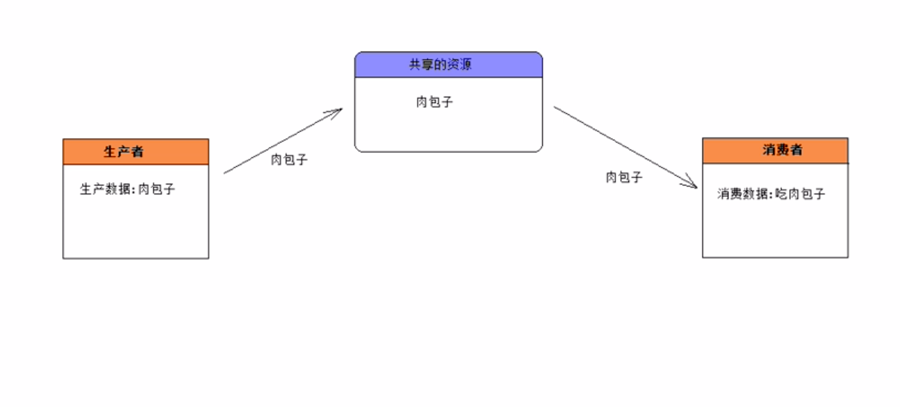
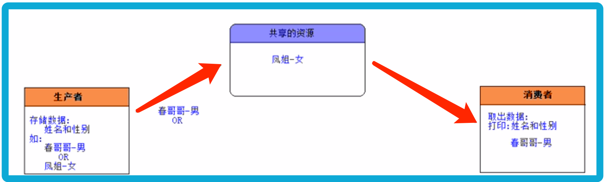
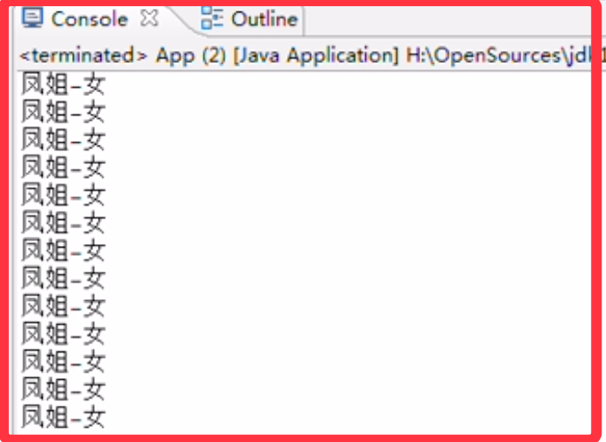
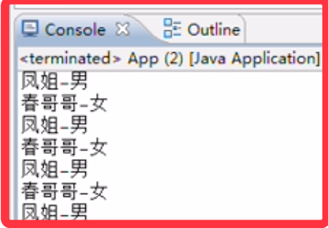

<!-- TOC -->

- [1. 线程通信](#1-线程通信)
  - [1.1. 案例释义](#11-案例释义)
    - [1.1.1. 分析示图:](#111-分析示图)
    - [1.1.2. 案例描述](#112-案例描述)
    - [1.1.3. 案例实现](#113-案例实现)
    - [1.1.4. 实现效果与异常](#114-实现效果与异常)
    - [1.1.5. 异常分析](#115-异常分析)
    - [1.1.6. 异常解决方案](#116-异常解决方案)
  - [1.2. 对象中的 wait 和 notify 方法](#12-对象中的-wait-和-notify-方法)
    - [1.2.1. 通信流程](#121-通信流程)

<!-- /TOC -->

## 1. 线程通信
- 不同的线程执行不同的任务, 若这些任务有联系, 线程之间必须能够通信才能协调完成工作.  

### 1.1. 案例释义
- 经典的生产者和消费者案例(Producer/Consumer):


#### 1.1.1. 分析示图:  
1) 生产者和消费者应该操作共享的资源(实现方式来做). 
2) 使用一个或多个线程来表示生产者(Producer).
3) 使用一个或多个线程来表示消费者(Consumer).
4) 这种将生产者/资源/消费者独立开来的设计模式体现了面向对象的思想  
   1) 实现了低耦合, 使得每件事物之间互相独立;
   2) 让生产者和消费者之间通过第三方进行交换数据, 使其互相不需引用.

#### 1.1.2. 案例描述

- 如上获取一个全新的更为详细的案例描述:
  - 生产者负责存入姓名和性别数据
  - 消费者负责取出数据并进行打印

- 对于生产者来说:  
如果共享资源中没有数据, 则生产者负责生产一个数据(姓名-性别), 共享资源为不空了.  
否则生产者等待消费者消费该数据.  

- 对于消费者来说:  
如果共享资源中没有数据, 则消费者应该等待生产者生产数据.   
否则消费者取出该数据. 共享资源为空了.

#### 1.1.3. 案例实现
- 共享资源类的实现
```java
//共享资源对象(姓名-性别) 
public class ShareResource {
    private String name;
    private String gender;

    /**
     * 生产者向共享资源对象中存储数据
     * @param name 存储的姓名
     * @param gender 存储的性别
     */
    public void push(String name, String gender) {
        this.name = name;
        this.gender = gender;
    }

    /**
    * 消费者从共享资源对象中取出数据
    */
    public void popup() {
        System.out.println(this.name + "-" + this.gender);
    }
}
```

- 生产者类的实现
```java
//生产者
public class Producer implements Runnable {
    //共享的资源对象, 设定为 null
    private ShareResource resource = null;

    //通过构造器将共同的共享资源传递进来 
    public Producer(ShareResource resource) {
        this.resource = resource;
    }

    public void run() {
        for (int i = O; i < 50; i++) {
            if (i % 2 == 0) {
                resource.push("春哥哥"，"男");
            } else {
                resource.push("凤姐", "女");
            }
        }
    }
}
```

- 消费者类的实现
```java
//消费者
public class Consumer implements Runnable {
    //共享的资源对象
    private ShareResource resource = null;

    public Consumer(ShareResource resource) {
        this.resource = resource;
    }

    public void run() {
        for (int i = 0; i < 50; i++) {
            resource.popup();
        }
    }
}
```

- 测试类的实现
```java
//测试代码
pablic class App {
    public static void main (String[] args) {
        //创建生产者和消费者共同的资源对象
        ShareResource resource = new ShareResource();
        //启动生产者线程
        new Thread(new Producer(resource)).start();
        //启动消费者线程
        new Thread(new Consumer(resource)).start();
    }
}
```

#### 1.1.4. 实现效果与异常
- 会发现性别出现紊乱, 没有理想效果中的一男一女交替打印.


- 然后通过在资源的存储方法中加入休眠, 则会出现性别紊乱.  
  - 修改后的代码
  ```java
  public void push(String name, String gender) {
      this.name = name;
      try {
          Thread.sleep(10);
      } catch (Exception ex) {
          ex.printStackTrace();
      }
      this.gender = gender;
  }
  ```
  - 运行结果与预设的存入结果并不一样, 甚至会有连续相同结果打印.
    


#### 1.1.5. 异常分析
- 上述运行结果当中出现了两个异常:  
  - 异常 1:  
    出现姓别紊乱的情况.
    
  - 异常 2:   
    应该出现生产一个数据消费一个数据;  
    应该交替出现:`春哥哥-男`->`凤姐-女`->`春哥哥-男`->`凤姐-女`...

- 异常产生原因:  
  - 第一个问题是由于线程没有相互同步, 因此导致数据获取出现紊乱, 性别出现紊乱.
  - 第二个问题解决则是因为没有使用等待和唤醒机制, 因而导致没有交替执行.

#### 1.1.6. 异常解决方案
- 异常 1 的解决方案为:  
  只需要保证在生产姓名&性别的过程保持同步, 中间不能让消费者线程干扰.  
  可以使用同步代码块/同步方法/锁机制来解决这个问题.  
  ```java
    //共享资源对象(姓名-性别) 
    public class ShareResource {
        private String name;
        private String gender;

        /**
        * 生产者向共享资源对象中存储数据
        * @param name 存储的姓名
        * @param gender 存储的性别
        */
        synchronized public void push(String name, String gender) {
            this.name = name;
            this.gender = gender;
        }

        /**
        * 消费者从共享资源对象中取出数据
        */
        synchronized public void popup() {
            System.out.println(this.name + "-" + this.gender);
        }
    }
  ```

### 1.2. 对象中的 wait 和 notify 方法
`java.lang.Object` 类提供类两类用于操作线程通信的方法.  
- `wait()` 方法:  
  调用该对象方法的线程会将其本身的同步锁释放, 然后 JVM 会把它存到等待池中,  
  该线程就开始等待由其它线程将其唤醒. 它本身并不能自行唤醒, 只能被其它线程唤醒.  

- `notify()` 方法:  
  调用该对象方法的线程会唤醒在等待池中等待的任意一个线程,  
  然后把该线程转到锁池中进行等待.  

- `notifyAll()` 方法:  
  调用该对象方法的线程会唤醒在等待池中等待的所有的线程, 并把线程转到锁池中等待.  

- 注意:  
  上述方法只能被同步监听锁对象来调用, 否则会报错 `IllegalMonitorStateException`.  

#### 1.2.1. 通信流程
假设 `A` 线程和 `B` 线程共同操作一个 `X` 对象, 并设定 `X` 对象为同步锁,  
因此 `A  B` 线程可以通过 `X` 对象的 `wait` 和 `notify` 方法来进行通信,  
流程如下:  

- 当 `A` 线程执行 `X` 对象的同步方法时, `A` 线程持有 `X` 对象的锁,  
   此时 `B` 线程没有执行机会, 因此 `B` 线程在 `X` 对象的锁池中等待.  

- `A` 线程在同步方法中执行 `X.wait()` 方法时, `A` 线程释放 `X` 对象的锁,  
   此时 `A` 线程就会进入 `X` 对象的等待池中, 进行等待被唤醒.  

- 在 `X` 对象的锁池中等待锁的 `B` 线程在 `A` 线程释放锁之后,  
  则会获取 `X` 对象的锁, 执行 `X` 的另一个同步方法.  

- `B` 线程在同步方法中执行 `X.notify()` 方法时, `JVM` 把 `A` 线程从 `X` 对象  
   的等待池中移动到 `X` 对象的锁池中, 等待获取锁.  

- `B` 线程执行完同步方法后, 会释放 `X` 对象的锁, 于是 `A` 线程获得锁继续执行同步方法.  