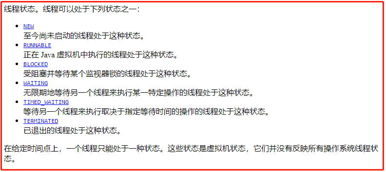
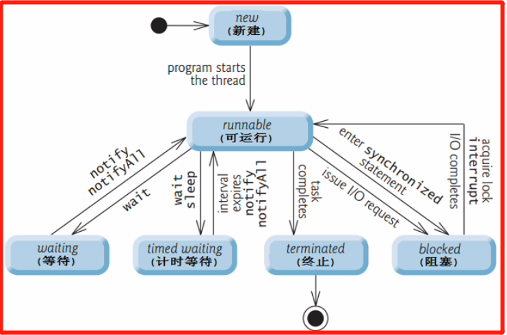

<!-- TOC -->

- [1. 线程的生命周期的概念](#1-线程的生命周期的概念)
  - [1.1. 线程生命周期状态图](#11-线程生命周期状态图)
  - [1.2. 线程生命周期的各个状态](#12-线程生命周期的各个状态)
    - [1.2.1. 新建状态 (new)](#121-新建状态-new)
    - [1.2.2. 可运行状态 (runnable)](#122-可运行状态-runnable)

<!-- /TOC -->

## 1. 线程的生命周期的概念  

### 1.1. 线程生命周期状态图
- 线程对象的状态是存放在 `Thread` 类的内部类 `State` 中.

- `State` 类是一个枚举类, 因为状态是固定不需修改的, 所以使用枚举类型存放.  
  

- 如下是根据枚举类中 6 种状态进行定义的线程状态图
    

### 1.2. 线程生命周期的各个状态

#### 1.2.1. 新建状态 (new)
- 使用 `new` 创建一个线程对象, 仅仅在堆中分配内存空间

- 新建状态下, 线程并没有启动, 只是存在一个线程对象而已  
  例如 `Thread t = new Thread()` 中 t 就属于新建状态.

- 因此新建状态是在调用线程对象的 `start()` 方法之前的.

#### 1.2.2. 可运行状态 (runnable)
- 当新建状态下的线程对象调用了 `start()` 方法后, 线程就进入了可运行状态.

- 分成两种状态: ready 和 running. 分别对应的是就绪状态和运行状态.  
  
  - 就绪状态:  
  线程对象调用 `start()` 方法后, 等待 JVM 调动, 此时线程没有运行.  
  - 运行状态:  
  线程对象获得 JVM 调度, 如果存在多个 CPU 那么运行多个线程并行运行.

- 注意:  
  线程对象的 `start()` 方法只能调用一次.