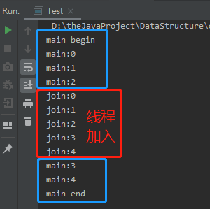

<!-- TOC -->

- [1. 线程控制操作](#1-线程控制操作)
  - [1.1. 线程休眠](#11-线程休眠)
  - [1.2. 联合线程](#12-联合线程)
    - [1.2.1. 联合线程实例:](#121-联合线程实例)

<!-- /TOC -->

## 1. 线程控制操作

### 1.1. 线程休眠
- 线程休眠会让执行的线程暂停一段时间, 进入计时等待状态.

- 通常会进行调用的方法是 `static void sleep(long mills)`  
  该方法位于 `java.lang.Thread` 当中, 是线程对象方法.

- 调用 `sleep()` 方法后, 当前线程放弃 CPU, 并在指定时间段内,  
  该调用 `sleep()` 方法的线程会进入等待池且不会获得执行的机会,  
  不过在此状态下, 睡眠的线程是不会释放同步锁/同步监听器的.

- 该方法通常用于模拟网络延迟, 让多线程并发访问同一个资源的错误效果更明显.   

### 1.2. 联合线程
- 线程的 `join()` 方法表示一个线程等待另一个线程完成后才执行.  
  
- `join()` 方法被插入的线程对象调用之后, 原线程对象会处于阻塞状态,  
  直到插入的线程执行完毕后, 原线程才会恢复运行.

- 称为联合线程是因为可以把调用 `join()` 方法的线程对象  
  和包含该线程对象的方法所属的线程对象联合在一起.

#### 1.2.1. 联合线程实例:  
- 将在主线程中插入一个新线程.  
  ```java
  class Join extends Thread {
      public void run() {
          for (int i = 0; i < 5; i++) {
              System.out.println("join:" + i);
          }
      }
  }

  public class Test {
      public static void main(String[] args) throws InterruptedException {
          Join joinThread = new Join();
          System.out.println("main begin");
          for (int i = 0; i < 5; i++) {
              System.out.println("main:" + i);
              if (i == 2) {
                  joinThread.start();
                  joinThread.join();
              }
          }
          System.out.println("main end");
      }
  }
  ```

- 效果图示:  
  如下图所示, 原主线程将会在插入线程执行完毕后, 再继续执行.  
  