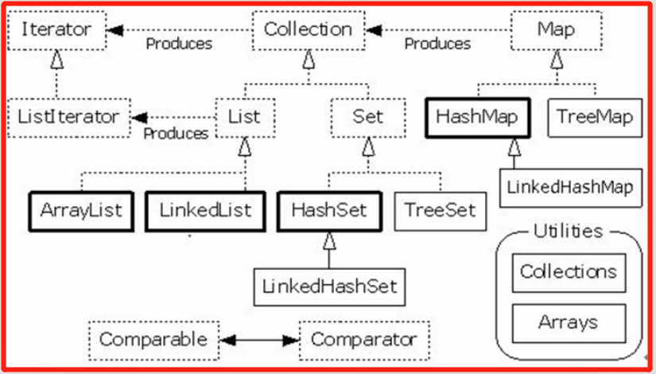
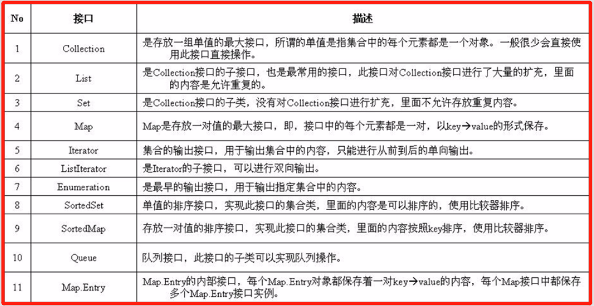
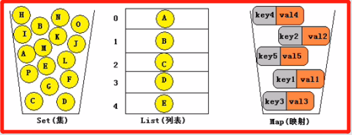

<!-- TOC -->

- [1. 集合框架的概述](#1-集合框架的概述)
  - [1.1. 常用的框架接口规范](#11-常用的框架接口规范)
  - [1.2. 常用的集合类](#12-常用的集合类)

<!-- /TOC -->

## 1. 集合框架的概述
- JAVA2之前, JAVA中并没有完整的集合框架, 只有一些简单的可自拓展的容器类,  
  比如 `Vector, Stack, Hashtable` 等类. 尽管这些可自拓展的容器类很好用,  
  但并不能进行集中和统一的管理.

- 集合框架是为表示和操作集合而规定的一种统一的标准的体系结构.  

- 任何集合框架都包含三部分内容: 
  - 对外的接口; 
  - 接口的实现;
  - 对集合运算的算法(底层对应某一数据结构的算法).

- 集合框架的必要性:  
  - 提供功能的复用(所有集合框架和接口都存在 `java.util` 包中);
  - 使用户专注于业务开发, 而非数据结构和算法(体现封装思想).

### 1.1. 常用的框架接口规范
- 下面图片中将列出一些常见的框架接口和实现的集合类  
  
  
- 集合中存储的对象称之为集合元素.
- 集合中所存储的必须是对象, 不能是基本数据类型.  
  但实际上编译不会出错是因为包含自动装箱的操作.

### 1.2. 常用的集合类

- Set(集):  
  集合中的对象不按特定方式排序, 不允许元素重复.
- List(列表):  
  集合中的对象按照索引位置排序, 允许元素重复.
- Map(映射):  
  集合中每一个元素都是一对键值对(`key-value`), 不允许`key`重复, 允许`value`重复.

