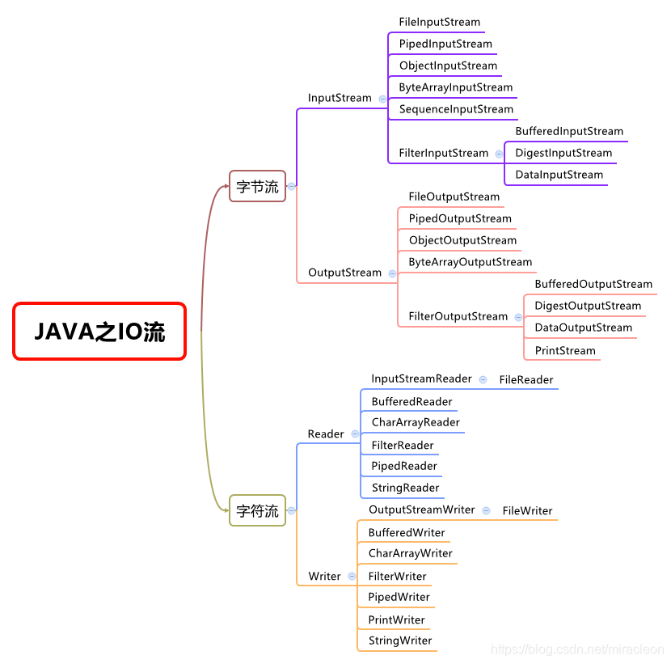

<!-- TOC -->

- [1. IO 流(输入输出流)](#1-io-流输入输出流)
  - [1.1. 操作 IO 流的模板](#11-操作-io-流的模板)
    - [1.1.1. 创建源或目标对象](#111-创建源或目标对象)

<!-- /TOC -->

## 1. IO 流(输入输出流)
- 这里使用的都是 `java.io` 包中的类.

- IO 指的就是 Input/Output, 即输入和输出.  
  IO 操作是相对的过程, 需要从程序角度进行分析.

- IO 流的分类如下:
  - 根据数据单位划分: 字节流和字符流
  - 根据流向划分: 输入流和输出流
  - 根据功能划分: 节点流和包装流  

- IO 中的四大基流:  
  - 字节输出流, 字节输入流, 字符输出流, 字符输入流.  
  - 四大基流都是抽象类, 其它流都是继承于它们的.  
    因此不能创建四大基流的对象, 只能创建其子类对象.  

- IO 流关闭资源:  
  - 每个流中都会存在 `close()` 方法, 用来关闭资源.
  - 如果操作文件后没有关闭资源, 该文件会一直被程序所引用,  
    就会导致它既不能删除, 也不能更改.

- IO 的具体分类如下, 按照四大基流进行划分:  
  

### 1.1. 操作 IO 流的模板

#### 1.1.1. 创建源或目标对象  
