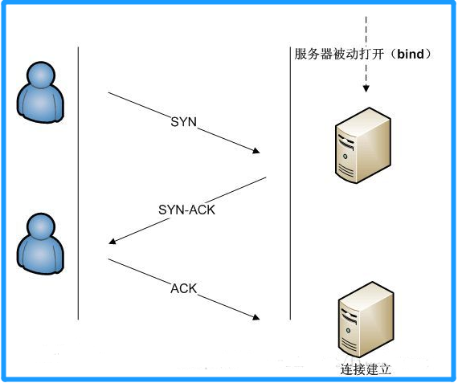
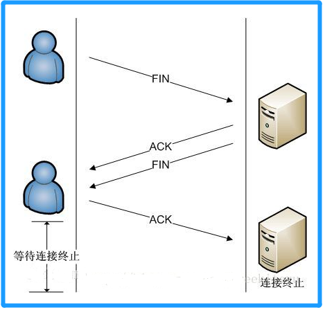

<!-- TOC -->

- [1. 传输层协议](#1-传输层协议)
  - [1.1. TCP](#11-tcp)
    - [1.1.1. TCP 协议的概述](#111-tcp-协议的概述)
    - [1.1.2. TCP 的传输特点](#112-tcp-的传输特点)
    - [1.1.3. TCP 建立连接的过程](#113-tcp-建立连接的过程)
  - [1.2. UDP](#12-udp)
- [2. TCP 和 UDP 操作实例](#2-tcp-和-udp-操作实例)
  - [2.1. TCP 实例](#21-tcp-实例)

<!-- /TOC -->

## 1. 传输层协议
- 传输层中有两个协议: TCP 和 UDP

### 1.1. TCP

#### 1.1.1. TCP 协议的概述
- 传输控制协议 TCP(Transmission Control Protocol) 协议,  
  是一种面向连接的, 可靠的, 基于字节流的传输层通信协议.
  - 面向连接, 传输可靠(保证数据正确性, 保证数据顺序)  
  - 用于传输大量数据(流模式)  
  - 速度慢, 建立连接需要开销较多(时间, 系统资源) 

#### 1.1.2. TCP 的传输特点
- 通过面向连接, 端到端和可靠的数据包发送.  
  - TCP 为了保证报文传输的可靠, 就给每个包一个序号,  
    同时序号也保证了传送到接收端实体的包的按序接收.  
    - 若接收端实体对已成功收到的字节发回一个相应的确认(ACK);  
    - 若发送端实体在合理的往返时延(RTT)内未收到确认, 对应的数据将会被重传. 

#### 1.1.3. TCP 建立连接的过程
- TCP 是因特网中的传输层协议, 使用三次握手协议建立连接.  

- 当主动方发出 SYN 连接请求后, 等待对方回答 SYN + ACK ,  
  并最终对对方的 SYN 执行 ACK 确认.  

- 这种建立连接的方法可以防止产生错误的连接,  
  TCP 使用的流量控制协议是可变大小的滑动窗口协议.

- TCP 建立连接的过程如下:  
  - 客户端发送 `SYN(SEQ=x)` 报文给服务器端, 进入 `SYN_SEND` 状态. 
  
  - 服务器端收到 `SYN` 报文, 回应一个 `SYN(SEQ=y)ACK(ACK=x+1)` 报文,  
    进入 `SYN_RECV` 状态. 
  
  - 客户端收到服务器端的 `SYN` 报文, 回应一个 `ACK(ACK=y+1)` 报文,  
    进入 `Established` 状态. 
  
  - 三次握手完成, TCP 客户端和服务器端成功地建立连接, 可以开始传输数据了. 
    

- TCP 断开连接的过程如下:  
  建立一个连接需要三次握手, 而终止一个连接要经过四次握手,  
  这是由 TCP 的半关闭(`half-close`)造成的.

  - 某个应用进程首先调用 close, 称该端执行"主动关闭"(`active close`)  
    该端的 TCP 于是发送一个 FIN 分节, 表示数据发送完毕. 
  
  - 接收到这个 FIN 的对端执行"被动关闭"(`passive close`),  
    这个 FIN 由 TCP 确认.  

  - 注意:  
    FIN 的接收也作为一个文件结束符(`end-of-file`)传递给接收端应用进程,  
    放在已排队等候该应用进程接收的任何其他数据之后, 因为, FIN 的接收意味着  
    接收端应用进程在相应连接上再无额外数据可接收.  

  - 一段时间后, 接收到这个文件结束符的应用进程将调用 close 关闭它的套接字.   
    这导致它的 TCP 也发送一个 FIN.
  
  - 接收这个最终 FIN 的原发送端 TCP(即执行主动关闭的那一端)确认这个 FIN.  
    整个过程每个方向都需要一个 FIN 和一个 ACK, 因此通常需要 4 个分节.
    
****

### 1.2. UDP
- 用户数据报协议 UDP(`User Datagram protocol`) 一种无连接的传输层协议,  
  提供面向事务的简单不可靠信息传送服务.

- 面向非连接, 传输不可靠(可能丢包/数据丢失),  
  用于传输少量数据(数据包模式), 速度快. 

## 2. TCP 和 UDP 操作实例
- 涉及到两个类, 分别对应服务端和客户端  
- 因此需要分别写出服务端和客户端的程序
- 这两个类为:  
  - `java.net.Socket` 此类实现客户端套接字
  - `java.net.ServerSocket` 此类实现服务器套接字

### 2.1. TCP 实例