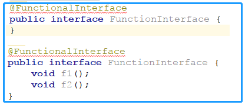
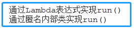
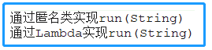

<!-- TOC -->

- [1. Lambda 表达式的概述](#1-lambda-表达式的概述)
  - [1.1. 函数式接口](#11-函数式接口)
  - [1.2. Lambda 表达式](#12-lambda-表达式)
    - [1.2.1. 转换示例](#121-转换示例)
  - [1.3. Lambda 表达式和函数式接口结合](#13-lambda-表达式和函数式接口结合)
    - [1.3.1. 实现步骤](#131-实现步骤)
    - [1.3.2. 实现实例](#132-实现实例)
  - [1.4. 其他形式的函数式接口及实现](#14-其他形式的函数式接口及实现)
    - [1.4.1. 有参无返回值的形式](#141-有参无返回值的形式)

<!-- /TOC -->

## 1. Lambda 表达式的概述
- JAVA8 中加入了函数式编程, 对于并行开发和基于事件开发十分便利.

### 1.1. 函数式接口
- 函数式接口就是只显式声明一个抽象方法的接口.   
- 为保证方法数量不多不少, java8 提供了一个专用注解 `@FunctionalInterface`.  
- 这样, 当接口中声明的抽象方法多于或少于一个时就会报错. 如下图所示:  
  

****

### 1.2. Lambda 表达式

#### 1.2.1. 转换示例
- Lambda 表达式本质上是匿名方法. 先来看下面这个例子:  
```java
public int add(int x, int y) {
    return x + y;
}
```  

- 转成 Lambda 表达式后是这个样子:
```java
(int x, int y) -> x + y;
```

- 参数类型也可以省略, Java 编译器会根据上下文推断出来:  
```java
(x, y) -> x + y; //返回两数之和
```

- 或者可以显示指名返回值:
```java
(x, y) -> { return x + y; } //显式指明返回值
```

- 可见 Lambda 表达式有三部分组成:  
  - 参数列表
  - 箭头（`->`）
  - 一条表达式或一个语句块

****

### 1.3. Lambda 表达式和函数式接口结合

#### 1.3.1. 实现步骤
- 新建无参函数式接口(先演示无参)
- 新建包含属性为函数式接口的类
- 实现函数式接口
- 测试函数式接口的方法

#### 1.3.2. 实现实例
- 新建无参函数式接口
```java
@FunctionalInterface
public interface InterfaceWithNoParam {
    void run();
}
```

- 新建包含属性为函数式接口的类
```java
public class TestJava8{
    InterfaceWithNoParam param;
}
```

- 实现函数式接口
```java
public class TestJava8{
	//匿名内部类的方式进行表示
	InterfaceWithNoParam param1 = new InterfaceWithNoParam() {
        @Override
        public void run() {
            System.out.println("通过匿名内部类实现run()");
        }
    };

	//Lambda表达式进行转换后的表示
    //空括号表示无参
	InterfaceWithNoParam param2 = () -> System.out.println("通过Lambda表达式实现run()") ;
}
```

- 测试函数式接口的方法
```java
@Test
public void testIntfaceWithNoparam() {

    this.param.run();
    this.param1.run();
}
```

- 测试结果   


****

### 1.4. 其他形式的函数式接口及实现
- 上述内容实现了无参无返回值的函数接口与实现, 当然还有其他形式:
  - 有参无返回值
  - 无参有返回值
  - 有参有返回值

#### 1.4.1. 有参无返回值的形式
- 接口
```java
@FunctionalInterface
public interface InterfaceWithParams {
    void run(String s);
}
```

- 实现
```java
InterfaceWithParams params = new InterfaceWithParams() {
    @Override
    public void run(String s) {
        System.out.println("通过" + s + "实现run(String)");
    }
};

InterfaceWithParams params1 = (String s) -> System.out.println("通过" + s + "实现run(String)");
```

- 测试
```java
this.params.run("匿名类");
this.params1.run("Lambda");
```

- 运行  



https://www.cnblogs.com/yw0219/p/7302597.html