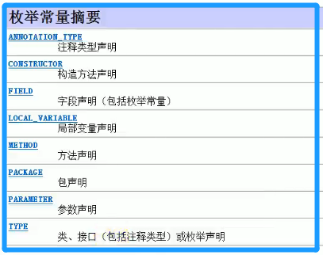

<!-- TOC -->

- [1. 注解(Annotation)](#1-注解annotation)
  - [1.1. 注解的概述](#11-注解的概述)
  - [1.2. JDK 自带的注解](#12-jdk-自带的注解)
    - [1.2.1. 作用在代码的注解](#121-作用在代码的注解)
  - [1.3. 作用在其他注解的注解(元注解)](#13-作用在其他注解的注解元注解)
    - [1.3.1. `@Retention`](#131-retention)
    - [1.3.2. `@Target`](#132-target)
    - [1.3.3. `@Documented`](#133-documented)
    - [1.3.4. `@Inherited`](#134-inherited)
  - [1.4. 注解的定义与使用](#14-注解的定义与使用)

<!-- /TOC -->

## 1. 注解(Annotation)

### 1.1. 注解的概述
- 从 JAVA5 开始, JAVA 开始对元数据进行支持, 也就是注解(Annotation).  

- 注解被用来为程序元素(类/方法/变量等)设置元数据.

- 元数据(metadata): 描述数据的数据

- 所有的注解(Annotation) 都是 `java.lang.annotation.Annotation` 接口的子接口,  
  所以 Annotation 是一种特殊的接口.

****

### 1.2. JDK 自带的注解

#### 1.2.1. 作用在代码的注解
|注解|作用|注意事项|
|--|--|--|
|`@Override`|检查该方法是否是重写方法, 如果发现其父类,  或者是引用的接口中并没有该方法时, 会报编译错误.||
|`@Deprecated`|标记过时方法, 如果使用被标记的方法, 会报编译警告.|不推荐使用|
|`@SuppressWarnings`|指示编译器去忽略注解中声明的警告||
|`@SafeVarargs`|忽略任何使用参数为泛型变量的方法或构造函数调用产生的警告.|Java 7 开始支持|
|`@FunctionalInterface`|标识一个匿名函数或函数式接口|Java 8 开始支持|
|`@Repeatable`|标识某注解可以在同一个声明上使用多次|Java 8 开始支持|

****

### 1.3. 作用在其他注解的注解(元注解)

#### 1.3.1. `@Retention`  
- 表示注解可以保存在哪一个时期, 保存时期的常量值,  
  被封装在 `RetentionPolicy` 枚举类中.  

- 一般来说, 自定义注解, 都使用 `RUNTIME`   
  这样就能在运行时期通过反射赋予注解功能

- 保存时期分为三种:  
  - `SOURCE`:  
    注解只能存在于源文件中, 编译后就不会出现在字节码文件中
  
  - `CLASS`:  
    注解可以存在源文件和字节码文件中, 但加载进 JVM 后,  
    在 JVM 就找不到这个注解了.
  
  - `RUNTIME`:  
    注解可以存在源文件, 字节码和 JVM 当中.

#### 1.3.2. `@Target`
- 表示注解可以贴在什么位置(类/方法/字段等).  
  位置的常量值被封装在 `ElementType` 枚举类中.

- 常量值如下图所示:  
  

#### 1.3.3. `@Documented`
- 使用该标签注解后的标签, 会保存到 API 文档当中.

#### 1.3.4. `@Inherited`
- 被该标签所注解的标签可以被子类所继承

****

### 1.4. 注解的定义与使用

