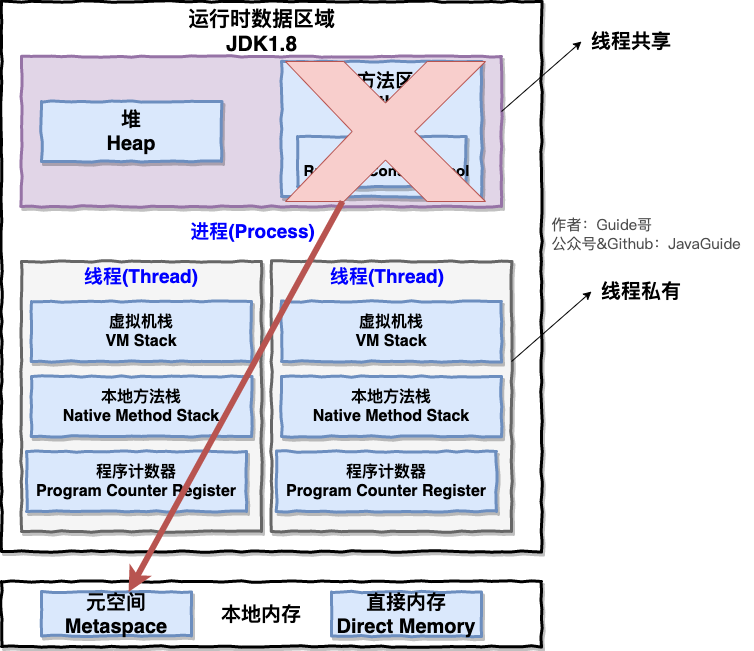

<!-- TOC -->

- [1. 并行和并发](#1-并行和并发)
  - [1.1. 概念和区别](#11-概念和区别)
    - [1.1.1. 并行的概念](#111-并行的概念)
    - [1.1.2. 并发的概念](#112-并发的概念)
    - [1.1.3. 计算机层面上的阐释](#113-计算机层面上的阐释)
- [2. 进程和线程](#2-进程和线程)
  - [2.1. 概念分析](#21-概念分析)
    - [2.1.1. 进程的概念](#211-进程的概念)
    - [2.1.2. 线程的概念](#212-线程的概念)
    - [2.1.3. 多进程和多线程](#213-多进程和多线程)
  - [2.2. 进程与线程的区别](#22-进程与线程的区别)
    - [2.2.1. 进程的空间分配](#221-进程的空间分配)
    - [2.2.2. 线程的空间分配](#222-线程的空间分配)
    - [2.2.3. 线程的执行安排](#223-线程的执行安排)
    - [2.2.4. 进程的运行和线程的调度](#224-进程的运行和线程的调度)
  - [2.3. 多线程的优势](#23-多线程的优势)
    - [2.3.1. 多线程下载的原理](#231-多线程下载的原理)
- [3. JVM 中进程和线程的关系](#3-jvm-中进程和线程的关系)
  - [3.1. 图解说明](#31-图解说明)
  - [3.2. 为什么线程中的栈空间是私有的, 进程中的堆空间和方法区可以共享?](#32-为什么线程中的栈空间是私有的-进程中的堆空间和方法区可以共享)
    - [3.2.1. 程序计数器为什么是私有的?](#321-程序计数器为什么是私有的)
    - [3.2.2. 虚拟机栈和本地方法栈为什么是私有的?](#322-虚拟机栈和本地方法栈为什么是私有的)
  - [3.3. 简单总结堆空间和方法区](#33-简单总结堆空间和方法区)

<!-- /TOC -->

## 1. 并行和并发

### 1.1. 概念和区别
- 以下概念均指代的是微观情况

#### 1.1.1. 并行的概念
- 指两个或多个事件在同一时刻点发生, 即单位时间内, 多个任务同时执行.

#### 1.1.2. 并发的概念
- 指两个或多个事件在同一时间段内发生(指的是类似于 0.01ms 长度的微观时间段)
- 即同一时间段, 多个任务都在执行(单位时间内不一定同时执行)

#### 1.1.3. 计算机层面上的阐释
- 在操作系统中, 在多道程序环境下, 并发性是指在一段时间内宏观上有多个程序在同时运行,  
但在单 CPU 系统中, 每一时刻仅能有一道程序执行 (时间片: CPU 分配给各程序的运行时间,  
也是微观的概念), 故微观上这些程序只能是分时地交替执行.  

- 倘若计算机系统中有多个 CPU, 则这些可以并发执行的程序便可被分配到多个处理器上,  
从而实现多任务并行执行, 即利用每个处理器来处理一个可并发执行的程序,  
这样, 多个程序便可同时执行, 因为是微观的, 所以宏观上感觉就是多个程序是同时执行.  

- 因此多核处理器之所以能提高了电脑的运行效率, 是因为可以同时并行地处理多个程序.  

- 单核处理器的计算机是不能并行处理多个任务的, 只能是多个任务在单个 CPU 上并发运行.   

- 同理, 线程也是一样的, 从宏观角度上线程是并行运行的, 但微观角度上分析却是串行运行的,  
即一个线程一个线程的去运行, 当系统只有一个CPU时, 线程会以某种顺序执行多个线程,  
这种情况就称为线程调度. 

## 2. 进程和线程

### 2.1. 概念分析  

#### 2.1.1. 进程的概念
- 进程是指一个内存中运行中的应用程序. 每个进程都有一块独立的内存空间,  
  一个应用程序可同时启动多个进程. 例如 Windows 中, 一个运行的 xx.exe 就是一个进程.  

- 那么我们此时就可以处理同时玩游戏和听音乐的问题了, 我们可以设计成两个程序,  
一个专门负责玩游戏, 一个专门负责听音乐.   

- 但是有时候开发一种软件例如游戏, 其内部会有多个功能同时调动的需求, 例如每个人物的活动,  
若要使用进程实现, 则可能要开 N 个进程才能完成, 这样的设计显然是不合理的.  

- 而且大多数操作系统都不需要一个进程访问其他进程的内存空间, 因此进程间的通信很不方便.  
此时需要得引入“线程”这门技术, 来解决这个问题.  

#### 2.1.2. 线程的概念
- 线程是指进程中的一个执行任务(控制单元), 一个进程可同时并发多个线程,  
  例如多线程下载软件运用的就是这个原理.  

- 一个进程至少有一个线程, 为了提高效率, 可在一个进程中开启多个执行任务,  
  这种情况则称为多线程.  

#### 2.1.3. 多进程和多线程
- 多进程: 操作系统中同时运行的多个程序.  
- 多线程: 在同一个进程中同时运行的多个任务.  

- Win 环境下的任务管理器:  
  在操作系统中允许存在多个任务, 每一个任务就是一个进程;  
  每一个进程又可同时执行多个子任务, 每一个子任务就是线程. 

### 2.2. 进程与线程的区别

#### 2.2.1. 进程的空间分配  
- 有独立的内存空间, 每个进程中的数据存放空间(包括堆空间和栈空间)都是相互独立的,   
  而且每个进程中都应至少有一个线程, 否则这个进程毫无意义.  
  
- 实际上 Java 程序的进程里至少包含两个线程: 主线程和垃圾回收线程(后台线程).

- 每个 java 程序都是 JVM 的一个实例, 一个 JVM 实例实际就是 JVM 上运行的进程.

#### 2.2.2. 线程的空间分配  
- 进程单独给每个线程划分了栈空间, 而进程中的堆空间和方法区是共享的, 因此线程之间可以相互影响.  

- 同类的多个线程共享进程的堆和方法区资源, 但每个线程有自己的程序计数器、虚拟机栈和本地方法栈,   
  所以系统在产生一个线程, 或是在各个线程间切换工作时, 负担要比进程小得多, 因此线程也被称为轻量级进程.

#### 2.2.3. 线程的执行安排  
- 因为一个进程中的多个线程是并发运行的, 但在微观角度上线程执行是有先后顺序的,   
  不过哪个线程执行完全取决于 CPU 调度器(JVM的调整), 编码人员是无法进行控制的.  

- 因此可以把多线程并发看作是多个线程在瞬间抢 CPU 资源,  
  哪个线程抢到资源就运行这个线程, 因此也造就了多线程的随机性.   

#### 2.2.4. 进程的运行和线程的调度  
- 计算机通常只有一个 CPU 时, 在任一时刻只能执行一条计算机指令,  
  每一个进程只有获得 CPU 的使用权才能执行指令.  
  
- 多进程并发运行, 从宏观上看其实是各个进程轮流获得 CPU 的使用权,  
  分别执行各自的任务, 因此在可运行池中, 会有多个线程处于就绪状态,  
  一旦抢到了 CPU 资源, 就开始执行. 
  
- JVM 负责的是线程的调度, 采用的是抢占式调度, 没有采用分时调度, 因而造成多线程执行结果的随机性.

   
### 2.3. 多线程的优势
多线程作为一种多任务, 并发的工作方式, 存在着如下优势:  
- 进程之间并不能共享内存, 但线程之间(堆内存)可以.

- 系统创建进程时需要为该进程重新分配系统资源,  
  而创建线程的代价则小很多, 因此实现多任务并发时,  
  采用多线程会让效率更高.

- Java 本身内置多线程功能的支持, 而不是单纯地作为  
  底层系统的调度方式, 从而简化了多线程编程.

#### 2.3.1. 多线程下载的原理
- 可以理解为一个线程就是一个文件的下载通道, 多线程就是同时开启好几个下载通道.  

- 当服务器提供下载服务时, 使用下载者是共享带宽的, 在优先级相同的情况下,  
总服务器会对总下载线程进行平均分配. 因此线程越多, 下载速度越快.  

- 多线程是为了同步完成多项任务, 不是为了提供程序运行效率,  
而是通过提高资源使用效率来提高系统的效率.

## 3. JVM 中进程和线程的关系

### 3.1. 图解说明
- 下图是 Java 内存区域, 通过下图我们从 JVM 的角度来说一下线程和进程之间的关系.
  

  - 每个进程都是独立的 JVM 实例, 然后进程被运行时会被分配独立的存储空间, 其中就存放着每个线程的栈.
  - 每个线程都有自己独有的栈空间, 包括虚拟机栈, 本地方法栈和程序计数器, 里面的资源不共享.
  - 多个线程之间共享进程中的堆空间和方法区(JDDK1.8 后的元空间)中的资源.

- 总结: 
  - 线程是进程划分成的更小的运行单位. 
  - 线程和进程最大的不同在于基本上各进程是独立的, 线程则不一定, 因为同一进程中的线程极有可能会相互影响. 
  - 线程执行开销小, 但不利于资源的管理和保护, 进程则相反. 

### 3.2. 为什么线程中的栈空间是私有的, 进程中的堆空间和方法区可以共享?

#### 3.2.1. 程序计数器为什么是私有的?
- 程序计数器主要有下面两个作用:
  - 字节码解释器通过改变程序计数器来依次读取指令, 从而实现代码的流程控制, 如: 顺序执行、选择、循环、异常处理. 
  - 在多线程的情况下, 程序计数器用于记录当前线程执行的位置, 从而当线程被切换回来的时候能够知道该线程上次运行到哪儿了. 

- 需要注意的是, 如果执行的是 native 方法, 那么程序计数器记录的是 undefined 地址, 只有执行的是 Java 代码时程序计数器记录的才是下一条指令的地址. 

- 所以, 程序计数器私有主要是为了线程切换后能恢复到正确的执行位置. 

#### 3.2.2. 虚拟机栈和本地方法栈为什么是私有的?
- 虚拟机栈:  
  - 每个 Java 方法在执行的同时会创建一个栈帧用于存储局部变量表, 操作数栈, 常量池引用等信息.    
    从方法调用直至执行完成的过程, 就对应着一个栈帧在 Java 虚拟机栈中入栈和出栈的过程. 

- 本地方法栈:  
  - 和虚拟机栈所发挥的作用非常相似, 区别是:  虚拟机栈为虚拟机执行 Java 方法(也就是字节码)服务,    
    而本地方法栈则为虚拟机使用到的 Native 方法服务.  在 HotSpot 虚拟机中和 Java 虚拟机栈合二为一. 

- 所以, 为了保证线程中的局部变量不被别的线程访问到, 虚拟机栈和本地方法栈是线程私有的. 

### 3.3. 简单总结堆空间和方法区
- 堆和方法区是所有线程共享的资源. 
- 其中堆是进程中最大的一块内存, 主要用于存放新创建的对象 (几乎所有对象都在这分配内存). 
- 方法区主要用于存放已被加载的类信息, 常量, 静态变量, 即时编译器编译后的代码等数据. 