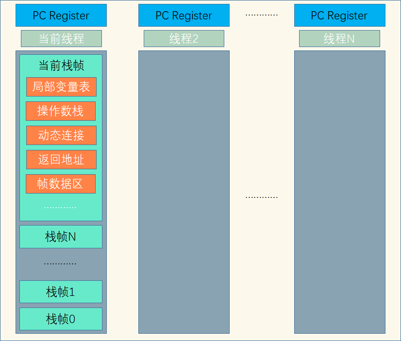

<!-- TOC -->

- [1. 线程运行](#1-线程运行)
  - [1.1. 栈和栈帧](#11-栈和栈帧)
  - [1.2. 线程上下文切换(Thread Context Switch)](#12-线程上下文切换thread-context-switch)
    - [1.2.1. 上下文切换的原因](#121-上下文切换的原因)
    - [1.2.2. 切换的原理](#122-切换的原理)
    - [1.2.3. 切换带来的问题](#123-切换带来的问题)

<!-- /TOC -->

## 1. 线程运行

### 1.1. 栈和栈帧
 - JVM 中由堆、栈、方法区组成, 其中栈内存是给线程使用的, 每个线程启动后, JVM 就会为其分配一块栈内存
   - 每个栈由多个栈帧(Frame)组成, 对应着每次方法调用时所占用的内存 
   - 每个线程只能有一个活动栈帧, 对应着当前正在执行的那个方法
   - 每个方法执行完后, 对应的栈帧就会出栈, 回到上一个调用该方法的栈帧
   - 栈帧全部出栈后, JVM 则会结束代码的执行

- 每个线程的栈内存都是互相独立,互不干扰的.     
  

### 1.2. 线程上下文切换(Thread Context Switch)
- CPU 给每个线程分配时间片, 在当前线程的时间片用完后会将其状态保存并停止执行, 接着加载下一线程的状态并开始执行.  
- 线程的状态被保存及再加载, 这段过程就叫做上下文切换.

#### 1.2.1. 上下文切换的原因
- 以下原因会导致 CPU 不再执行当前的线程, 转而执行另一个线程的代码
  - 线程的 CPU 时间片用完
  - 垃圾回收, 垃圾回收线程会暂停所有工作线程, 等待其执行完后再继续执行其它线程
  - 有更高优先级的线程需要运行
  - 线程自己调用了 sleep、yield、wait、join、park、synchronized、lock 等方法主动暂停执行

#### 1.2.2. 切换的原理
- 当 Context Switch 发生时, 需要由操作系统保存当前线程的状态, 并恢复另一个线程的状态.
- 保存的状态包括程序计数器中的信息、虚拟机栈中每个栈帧的信息, 如局部变量、操作数栈、返回地址等.
- 其中程序计数器(Program Counter Register)的作用是记住下一条 JVM 指令的执行地址, 是线程私有的. 

#### 1.2.3. 切换带来的问题
- Context Switch 频繁发生会影响性能, 导致额外的开销, 常表现为高并发执行时速度会慢串行, 因此减少上下文切换次数可以提高多线程运行效率.
  - 直接消耗: 指的是 CPU 寄存器需要保存和加载, 系统调度器的代码需要执行, TLB 实例需要重新加载, CPU 的 pipeline 需要刷掉.
  - 间接消耗: 指的是多核的 cache 之间得共享数据, 间接消耗对于程序的影响要看线程工作区操作数据的大小.

