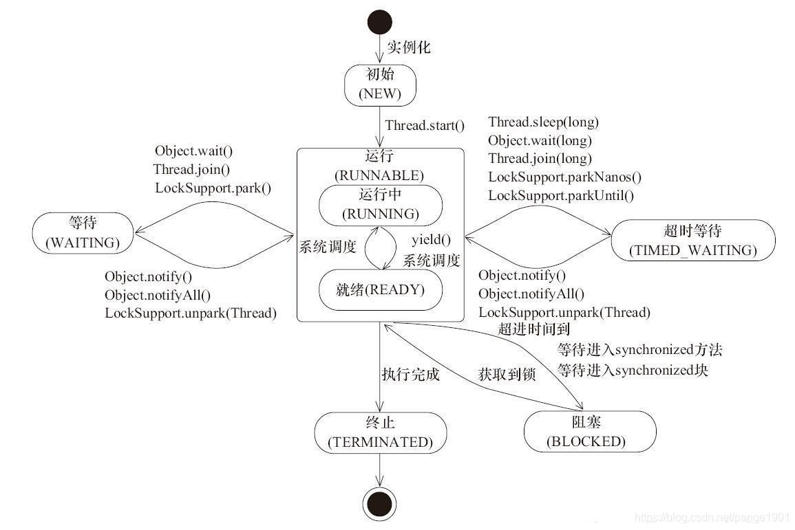

<!-- TOC -->

- [1. 线程状态](#1-线程状态)
  - [1.1. 线程状态分类](#11-线程状态分类)
    - [1.1.1. 状态图例](#111-状态图例)
  - [1.2. 状态详细说明](#12-状态详细说明)
    - [1.2.1. 初始状态(NEW)](#121-初始状态new)
    - [1.2.2. 就绪状态(RUNNABLE之READY)](#122-就绪状态runnable之ready)
    - [1.2.3. 运行中状态(RUNNABLE之RUNNING)](#123-运行中状态runnable之running)
    - [1.2.4. 阻塞状态(BLOCKED)](#124-阻塞状态blocked)
    - [1.2.5. 等待(WAITING)](#125-等待waiting)
    - [1.2.6. 超时等待(TIMED_WAITING)](#126-超时等待timed_waiting)
    - [1.2.7. 终止状态(TERMINATED)](#127-终止状态terminated)

<!-- /TOC -->

## 1. 线程状态

### 1.1. 线程状态分类
- JAVA 中线程的状态分为 6 种, 这 6 种状态定义在 Thread 类的 State 枚举中, 可查看源码进行一一对应

1. 初始(NEW): 新创建了一个线程对象, 但还没有调用 start 方法. 
2. 运行(RUNNABLE): JAVA 线程中将就绪(ready)和运行中(running)两种状态笼统的称为"运行". 
   - 线程对象创建后, 其他线程(比如 main 线程)调用了该对象的 start 方法, 然后进入就绪状态(ready). 
   - 就绪状态的线程位于可运行线程池中, 等待被线程调度选中, 获取 CPU 的使用权. 
   - 就绪状态的线程在获得 CPU 时间片后变为运行中状态(running). 
3. 阻塞(BLOCKED): 表示线程阻塞于锁. 
4. 等待(WAITING): 进入该状态的线程需要等待其他线程做出一些特定动作(通知或中断). 
5. 超时等待(TIMED_WAITING): 该状态不同于 WAITING, 它可以在指定的时间后自行返回. 
6. 终止(TERMINATED): 表示该线程已经执行完毕. 

#### 1.1.1. 状态图例


### 1.2. 状态详细说明

#### 1.2.1. 初始状态(NEW)
- 实现 Runnable 接口和继承 Thread 可以得到一个线程类, new 一个实例出来, 线程就进入了初始状态. 

#### 1.2.2. 就绪状态(RUNNABLE之READY)
- 就绪状态只是说你资格运行, 调度程序没有挑选到你, 你就永远是就绪状态. 
- 调用线程的 start 方法, 此线程进入就绪状态. 
- 当前线程 sleep 方法结束, 其他线程 join 结束, 等待用户输入完毕, 某个线程拿到对象锁, 线程将进入就绪状态. 
- 当前线程时间片用完了, 调用当前线程的 yield 方法, 当前线程进入就绪状态. 
- 锁池里的线程拿到对象锁后, 进入就绪状态. 

#### 1.2.3. 运行中状态(RUNNABLE之RUNNING)
- 线程调度器从可运行池中选择一个线程给它分配时间片让它执行, 此时进入运行状态.
- 被线程调度器选中并执行是线程进入运行状态的唯一一种方式. 

#### 1.2.4. 阻塞状态(BLOCKED)
- 阻塞状态是线程阻塞在进入 synchronized 关键字修饰的方法或代码块(获取锁)时的状态. 

#### 1.2.5. 等待(WAITING)
- 处于这种状态的线程不会被分配CPU执行时间, 它们要等待被其它线程显式地唤醒, 否则会处于无限期等待的状态. 
- 以下方式会让线程进入无限期等待的状态:  
    ```java
    1. 没有设置 Timeout 参数的 Object.wait() 方法.
    2. 没有设置 Timeout 参数的 Thread.join() 方法.
    3. LockSupport.park() 方法.
    ```

#### 1.2.6. 超时等待(TIMED_WAITING)
- 处于这种状态的线程不会被分配 CPU 执行时间, 不过无须无限期等待或被其他线程显式地唤醒, 在达到一定时间后它们会自动唤醒. 
- 以下方式会让线程进入超时等待状态:  
    ```java
    1. Thread.sleep(long millis) 方法. 
    2. 设置了 Timeout 参数的 Object.wait() 方法. 
    3. 设置了 Timeout 参数的 Thread.join() 方法. 
    4. LockSupport.parkNanos() 方法. 
    5. LockSupport.parkUntil() 方法. 
    ```

#### 1.2.7. 终止状态(TERMINATED)
- 当线程的 run 方法完成时, 或者主线程的 main 方法完成时, 我们就认为它终止了.  
  这个线程对象也许是活的, 但是它已经不是一个单独执行的线程. 线程一旦终止了, 就不能复生. 
- 在一个终止的线程上调用 start 方法, 会抛出 `java.lang.IllegalThreadStateException` 异常. 