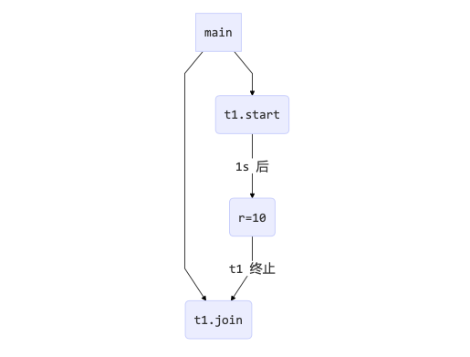
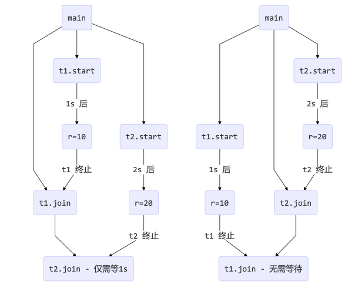

<!-- TOC -->

- [1. join 方法详解](#1-join-方法详解)
  - [1.1. 方法作用](#11-方法作用)
    - [1.1.1. join 源码分析](#111-join-源码分析)
  - [1.2. 使用案例](#12-使用案例)
    - [1.2.1. 分析](#121-分析)
    - [1.2.2. 解决方法](#122-解决方法)
- [2. join 的应用](#2-join-的应用)
  - [2.1. 同步线程设计](#21-同步线程设计)
  - [2.2. 利用 join 等待多个线程执行结果](#22-利用-join-等待多个线程执行结果)
    - [2.2.1. 案例 1](#221-案例-1)
    - [2.2.2. 案例 2](#222-案例-2)
    - [2.2.3. 两个案例的过程图示](#223-两个案例的过程图示)
  - [2.3. 在 join 中设置等待时间](#23-在-join-中设置等待时间)
    - [2.3.1. 案例 1: 等够时间](#231-案例-1-等够时间)
    - [2.3.2. 案例 2: 没有等够时间](#232-案例-2-没有等够时间)

<!-- /TOC -->

## 1. join 方法详解

### 1.1. 方法作用
- join 方法可以让主线程等待当前线程对象执行结束后再执行. 也可以设置指定的等待时间.
- t.join() 方法只会使主线程(或者说调用 t.join() 的线程)进入等待池, 在等待 t 线程执行完毕后才会被唤醒. 
- 主线程等待 t 线程执行结果的过程中并不影响同一时刻处在运行状态的其他线程.

#### 1.1.1. join 源码分析
- join 方法的底层实际上是在调用 wait 方法.
- Thread 类中 join 方法的代码如下  
    ```java
    public final synchronized void join(final long millis)
    throws InterruptedException {
        if (millis > 0) {
            if (isAlive()) {
                final long startTime = System.nanoTime();
                long delay = millis;
                do {
                    wait(delay);
                } while (isAlive() && (delay = millis -
                        TimeUnit.NANOSECONDS.toMillis(System.nanoTime() - startTime)) > 0);
            }
        } else if (millis == 0) {
            while (isAlive()) {
                wait(0);
            }
        } else {
            throw new IllegalArgumentException("timeout value is negative");
        }
    }
    ```

### 1.2. 使用案例
- 为什么需要 join 方法?
- 下面的代码执行, 打印 r 是什么?
    ```java
    static int r = 0;
    public static void main(String[] args) throws InterruptedException {
        test1(); 
    }

    private static void test1() throws InterruptedException { 
        log.debug("开始");
        Thread t1 = new Thread(() -> {
            log.debug("开始"); 
            sleep(1); 
            log.debug("结束"); 
            r = 10;
        });
        t1.start(); 
        log.debug("结果为:{}", r); 
        log.debug("结束");
    }
    ```

#### 1.2.1. 分析
- 因为主线程和线程 t1 是并行执行的, t1 线程需要 1 秒之后才能算出 `r=10`
- 而主线程一开始就要打印 r 的结果, 所以只能打印出 `r=0` 

#### 1.2.2. 解决方法
- 用 join, 加在 `t1.start()` 之后即可

## 2. join 的应用

### 2.1. 同步线程设计
- 以调用方角度来讲, 如果
  - 需要等待结果返回, 才能继续运行就是同步
  - 不需要等待结果返回, 就能继续运行就是异步

- 以上面的案例为例, 则是线程同步的一种应用  
  

### 2.2. 利用 join 等待多个线程执行结果

#### 2.2.1. 案例 1
- 案例 1: 下面代码 cost 大约多少秒?
    ```java
    static int r1 = 0;
    static int r2 = 0;

    public static void main(String[] args) throws InterruptedException {
        test2(); 
    }

    private static void test2() throws InterruptedException { 
        Thread t1 = new Thread(() -> {
            sleep(1);
            r1 = 10; 
        });

        Thread t2 = new Thread(() -> { 
            sleep(2);
            r2 = 20;
        });

        long start = System.currentTimeMillis();
        t1.start();
        t2.start();

        t1.join();
        t2.join();
        long end = System.currentTimeMillis();
        
        log.debug("r1: {} r2: {} cost: {}", r1, r2, end - start);
    }
    ```

- 输出结果如下
  ```
  20:45:43.239 [main] c.TestJoin - r1: 10 r2: 20 cost: 2005
  ```

- 结果分析:  
  - 第一个 join: 等待 t1 时, t2 并没有停止, 而在运行
  - 第二个 join: 1s 后, 执行到此, t2 也运行了 1s, 因此也只需再等待 1s

#### 2.2.2. 案例 2
- 如果将案例 1 的两个 join 执行顺序颠倒, 那么耗时是多少
- 结果分析: 依旧和案例 1 的耗时一样

#### 2.2.3. 两个案例的过程图示


### 2.3. 在 join 中设置等待时间

#### 2.3.1. 案例 1: 等够时间
- 在 join 中设置的等待时间比线程中 sleep 设置的等待时间要长
    ```java
    static int r1 = 0;

    public static void main(String[] args) throws InterruptedException {
        test3(); 
    }

    public static void test3() throws InterruptedException { 
        Thread t1 = new Thread(() -> {
            sleep(1);
            r1 = 10; 
        });

        long start = System.currentTimeMillis(); 
        t1.start();

        // 线程执行结束会导致 join 结束
        t1.join(1500);
        long end = System.currentTimeMillis();
        
        log.debug("r1: {} cost: {}", r1, end - start);
    }
    ```

- 输出结果:  
  ```
  20:48:01.320 [main] c.TestJoin - r1: 10 cost: 1010
  ```

- 结果分析: 
  - r1 最终成功被设置为 10 进行输出, 但耗时只有 1s, 并非 join 等待的 1.5s.
  - 因此可知线程结束会提前终止 join, 所以最终等待时间要比 join 设置的短.

#### 2.3.2. 案例 2: 没有等够时间
- join 中设置的时间要比 sleep 中的短, 将上述代码中 sleep 设置时间改为 2 秒.
    ```java
    Thread t1 = new Thread(() -> {
        sleep(2);
        r1 = 10; 
    });
    ```

- 输出结果:  
  ```
  20:52:15.623 [main] c.TestJoin - r1: 0 cost: 1502
  ``` 

- 结果分析: 
  - r1 并没有被设置为 10, 依旧是 0. 耗时是 join 等待的 1.5s.
  - 虽然 join 等待结束, 但此时线程中 sleep 设置的等待时间还有 0.5s,  
    所以 t1 线程并没有真的被等待执行完, 主线程就继续往下执行了, 因此 r1 没有被赋值.
  - 这样设置 join 等待并没有意义.