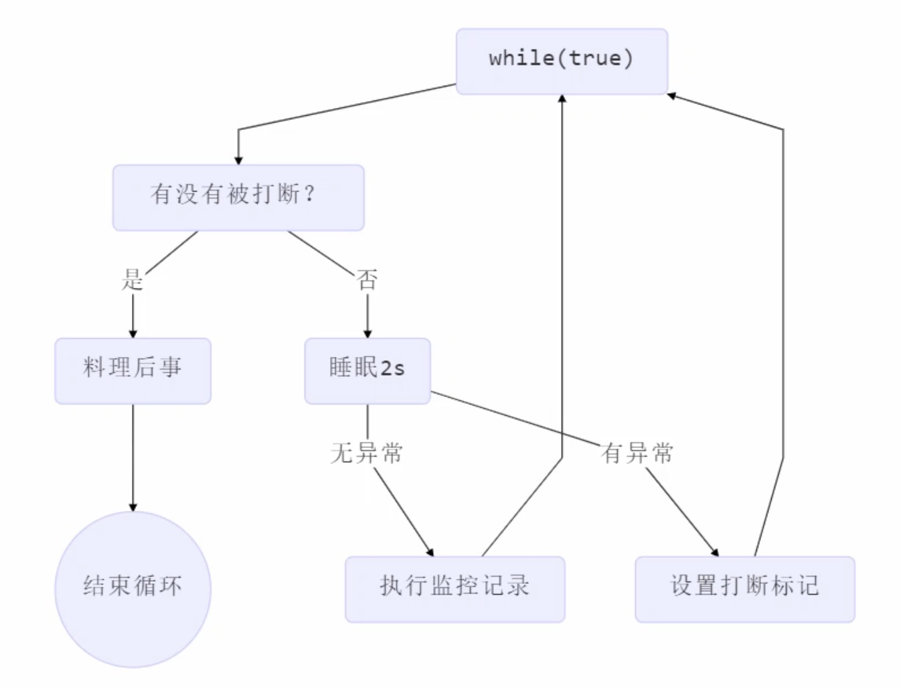

<!-- TOC -->

- [1. 两段终止模式](#1-两段终止模式)
  - [1.1. 错误思路](#11-错误思路)
  - [1.2. 两阶段终止模式流程](#12-两阶段终止模式流程)
    - [1.2.1. 利用 isinterrupted 解决](#121-利用-isinterrupted-解决)
    - [1.2.2. 利用停止标记解决](#122-利用停止标记解决)

<!-- /TOC -->

## 1. 两段终止模式
- 如何在一个线程 T1 中优雅地终止线程 T2, 即给线程 T2 料理后事的机会.
- 可以在一些系统监控的流程中用到

### 1.1. 错误思路
- 使用线程对象的 stop 方法来停止线程
  - stop 方法会真正杀死线程, 如果此时线程锁住了共享资源, 那么它被杀死之后, 就再也没有机会释放锁, 就会让其它线程永远无法获取到锁.
- 使用 `System.exit(int)` 方法停止线程
  - 目的仅仅是停止一个线程, 这个方法会让整个程序都会停止.

### 1.2. 两阶段终止模式流程


#### 1.2.1. 利用 isinterrupted 解决
- interrupt 可以打断正在执行的线程, 无论这个线程是在 sleep, wait, 还是正常运行
    ```java
    class TPTInterrupt { 
        private Thread thread;
        public void start(){
            thread = new Thread(() -> {
                while(true) {
                    Thread current = Thread.currentThread(); 
                    if(current.isInterrupted()) {
                        log.debug("料理后事");
                        break; 
                    }
                    try {
                        Thread.sleep(1000); 
                        log.debug("将结果保存");
                    } catch (InterruptedException e) { 
                        current.interrupt();
                    }
                    // 执行监控操作 
                }
            },"监控线程");
            thread.start(); 
        }

        public void stop() { 
            thread.interrupt();
        } 
    }
    ```

- 调用  
    ```java
    TPTInterrupt t = new TPTInterrupt(); 
    t.start();
    
    Thread.sleep(3500); 
    log.debug("stop"); 
    t.stop();
    ```

- 结果  
    ```html
    11:49:42.915 c.TwoPhaseTermination [监控线程] - 将结果保存 
    11:49:43.919 c.TwoPhaseTermination [监控线程] - 将结果保存 
    11:49:44.919 c.TwoPhaseTermination [监控线程] - 将结果保存 
    11:49:45.413 c.TestTwoPhaseTermination [main] - stop 
    11:49:45.413 c.TwoPhaseTermination [监控线程] - 料理后事
    ```

#### 1.2.2. 利用停止标记解决  
- 线程   
    ```java
    // 停止标记用 volatile 是为了保证该变量在多个线程之间的可见性 
    // 我们的例子中，即主线程把它修改为 true 对 t1 线程可见
    class TPTVolatile {
        private Thread thread;
        private volatile boolean stop = false;
        
        public void start(){
            thread = new Thread(() -> {
                while(true) {
                    Thread current = Thread.currentThread(); 
                    if(stop) {
                        log.debug("料理后事");
                        break; 
                    }
                    try {
                        Thread.sleep(1000); 
                        log.debug("将结果保存");
                    } catch (InterruptedException e) {
                    }
                    // 执行监控操作 
                }
            },"监控线程");
            thread.start(); 
        }

        public void stop() { 
            stop = true;
            thread.interrupt(); 
        }
    }
    ```

- 调用  
    ```java
    TPTVolatile t = new TPTVolatile(); 
    t.start();
    Thread.sleep(3500); 
    log.debug("stop"); 
    t.stop();
    ```

- 结果  
    ```html
    11:54:52.003 c.TPTVolatile [监控线程] - 将结果保存 
    11:54:53.006 c.TPTVolatile [监控线程] - 将结果保存 
    11:54:54.007 c.TPTVolatile [监控线程] - 将结果保存 
    11:54:54.502 c.TestTwoPhaseTermination [main] - stop 
    11:54:54.502 c.TPTVolatile [监控线程] - 料理后事
    ```