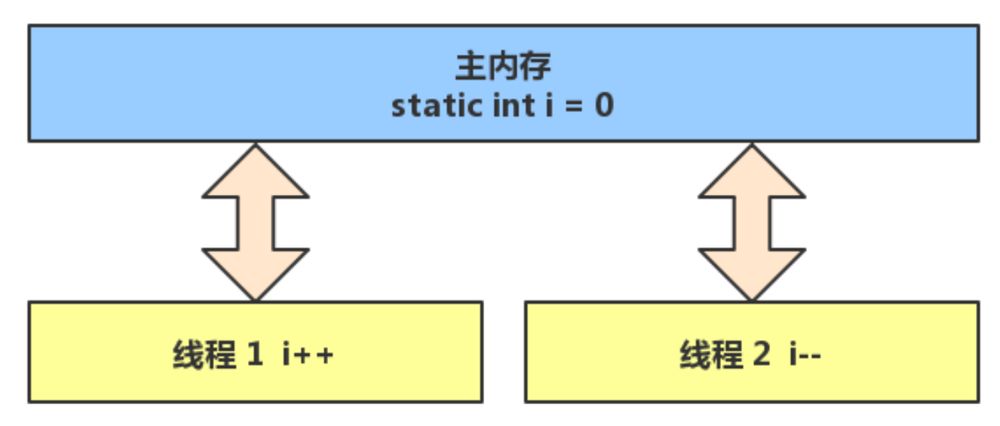
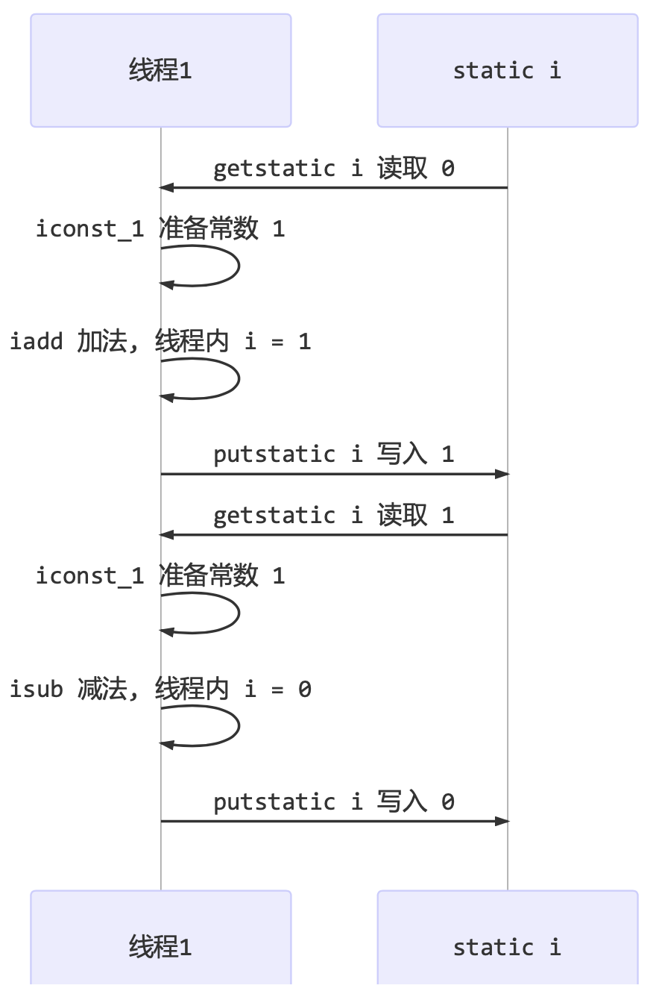
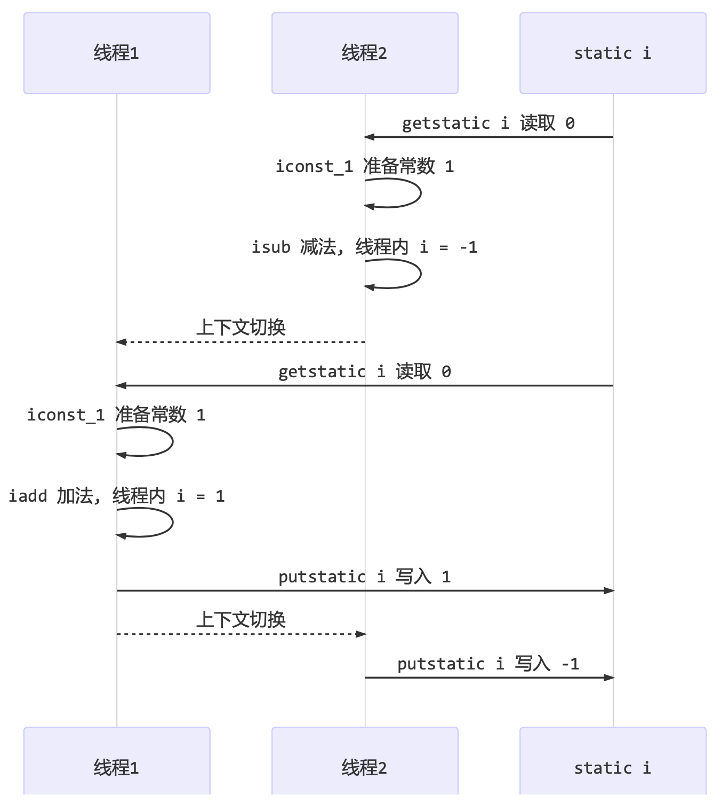
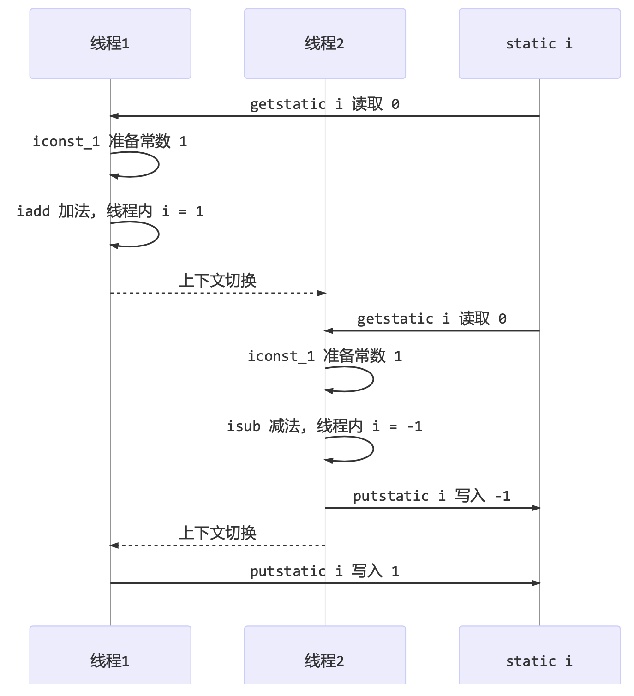

<!-- TOC -->

- [1. 共享存在的问题](#1-共享存在的问题)
  - [1.1. 案例](#11-案例)
  - [1.2. 分析](#12-分析)
  - [1.3. 临界区和竞态条件](#13-临界区和竞态条件)
    - [1.3.1. 临界区 Critical Section](#131-临界区-critical-section)
    - [1.3.2. 竞态条件 Race Condition](#132-竞态条件-race-condition)

<!-- /TOC -->

## 1. 共享存在的问题

### 1.1. 案例
- 两个线程对初始值为 0 的静态变量一个做自增, 一个做自减, 各做 5000 次, 结果是 0 吗?
    ```java
    static int counter = 0;
    public static void main(String[] args) throws InterruptedException { 
        Thread t1 = new Thread(() -> {
            for (int i = 0; i < 5000; i++) { 
                counter++;
            }
        }, "t1");

        Thread t2 = new Thread(() -> {
            for (int i = 0; i < 5000; i++) {
                counter--; 
            }
        }, "t2");

        t1.start();
        t2.start();

        t1.join();
        t2.join(); 
        log.debug("{}",counter);
    }
    ```

- 以上的结果可能是正数, 负数, 零. 为什么呢? 因为 Java 中对静态变量的自增, 自减并不是原子操作.

### 1.2. 分析
- 要彻底理解, 必须从字节码来进行分析:  
  - 例如对于 i++ 而言(i 为静态变量), 实际会产生如下的 JVM 字节码指令:  
    ```java
    getstatic i // 获取静态变量i的值
    iconst_1 // 准备常量1
    iadd // 自增
    putstatic i // 将修改后的值存入静态变量i
    ```
  - 对于 i-- 而言, 则如下:  
    ```java
    getstatic i // 获取静态变量i的值
    iconst_1 // 准备常量1
    isub // 自减
    putstatic i // 将修改后的值存入静态变量i
    ```

- 而 Java 的内存模型如下, 完成静态变量的自增, 自减需要在主存和工作内存中进行数据交换:  
  

- 如果是单线程以上 8 行代码是顺序执行(不会交错)没有问题:
  

- 但多线程下这 8 行代码可能交错运行, 出现负数的情况:  
  

- 出现正数的情况:  
  

### 1.3. 临界区和竞态条件

#### 1.3.1. 临界区 Critical Section
- 一个程序运行多个线程本身是没有问题的
- 问题出在多个线程访问**共享资源**
   - 多个线程读共享资源其实也没有问题
   - 在多个线程对共享资源读写操作时发生指令交错, 就会出现问题
- 一段代码块内如果存在对共享资源的多线程读写操作, 称这段代码块为**临界区**
- 例如, 下面代码中的临界区:  
    ```java
    static int counter = 0;
    static void increment() { 
        // 临界区
        counter++; 
    }
    static void decrement() { 
        // 临界区
        counter--; 
    }
    ```

#### 1.3.2. 竞态条件 Race Condition
- 多个线程在临界区内执行, 由于代码的**执行序列不同**而导致结果无法预测, 称之为发生了**竞态条件**.
- 为了避免临界区的竞态条件发生, 有多种手段可以达到目的.
  - 阻塞式的解决方案: synchronized, Lock 
  - 非阻塞式的解决方案: 原子变量