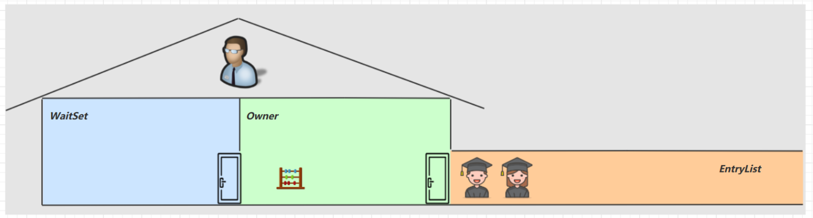
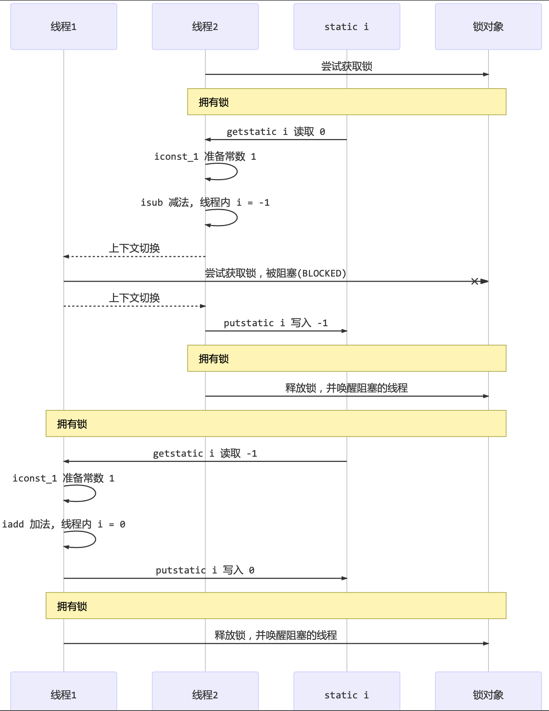

<!-- TOC -->

- [1. synchronized 关键字](#1-synchronized-关键字)
  - [1.1. 概述](#11-概述)
    - [1.1.1. 互斥和同步的细节](#111-互斥和同步的细节)
  - [1.2. 语法](#12-语法)
    - [1.2.1. 解决上一节中的共享问题](#121-解决上一节中的共享问题)
    - [1.2.2. 代码分析](#122-代码分析)
  - [1.3. 总结](#13-总结)
    - [1.3.1. 附加思考](#131-附加思考)
    - [1.3.2. 代码优化](#132-代码优化)
  - [1.4. 方法上的 synchronized](#14-方法上的-synchronized)

<!-- /TOC -->

## 1. synchronized 关键字

### 1.1. 概述
- synchronized 即俗称的`对象锁`, 它采用互斥的方式让同一时刻至多只有一个线程能持有`对象锁`, 其它线程再想获取这个`对象锁`时就会阻塞住.   
- 这样就能保证拥有锁的线程可以安全的执行临界区内的代码, 不用担心线程上下文切换.

#### 1.1.1. 互斥和同步的细节
- 虽然 java 中互斥和同步都可以采用 synchronized 关键字来完成, 但它们还是有区别的:
  - 互斥是保证临界区的竞态条件发生, 同一时刻只能有一个线程执行临界区代码;
  - 同步是由于线程执行的先后、顺序不同、需要一个线程等待其它线程运行到某个点.

### 1.2. 语法
```java
synchronized(对象) // 线程1,  线程2(blocked) 
{
    临界区
}
```

#### 1.2.1. 解决上一节中的共享问题
```java
static int counter = 0;
static final Object room = new Object();
public static void main(String[] args) throws InterruptedException { 
    Thread t1 = new Thread(() -> {
        for (int i = 0; i < 5000; i++) { 
            synchronized (room) {
                counter++; 
            }
        }
    }, "t1");

    Thread t2 = new Thread(() -> {
        for (int i = 0; i < 5000; i++) {
            synchronized (room) { 
                counter--;
            } 
        }
    }, "t2");

    t1.start();
    t2.start();
    t1.join();
    t2.join(); 
    
    log.debug("{}",counter);
}
```

#### 1.2.2. 代码分析

- 可以做这样的类比:
- `synchronized(对象)` 中的对象, 可以想象为一个房间(room), 有唯一入口(门)房间只能一次进入一人进行计算, 线程 t1, t2 想象成两个人.
- 当线程 t1 执行到 `synchronized(room)` 时就好比 t1 进入了这个房间, 并锁住了门拿走了钥匙, 在门内执行 `count++` 代码.
- 这时候如果 t2 也运行到了 `synchronized(room)` 时, 它发现门被锁住了, 只能在门外等待, 发生了上下文切换, 阻塞住了.
- 这中间即使 t1 的 CPU 时间片不幸用完, 被踢出了门外(不要错误理解为锁住了对象就能一直执行下去哦), 这时门还是锁住的,   
  t1 仍拿着钥匙, t2 线程还在阻塞状态进不来, 只有下次轮到 t1 自己再次获得时间片时才能开门进入.
- 当 t1 执行完 `synchronized{}` 块内的代码, 这时候才会从 obj 房间出来并解开门上的锁, 唤醒 t2 线程把钥匙给他.    
  t2 线程这时才可以进入 obj 房间, 锁住了门拿上钥匙, 执行它的 `count--` 代码.

- 图例所示:  


### 1.3. 总结
- synchronized 实际是用对象锁保证了临界区内代码的原子性, 临界区内的代码对外是不可分割的, 不会被线程切换所打断.

#### 1.3.1. 附加思考
- 如果把 `synchronized(obj)` 放在 for 循环的外面, 如何理解?
  - 由于会保证临界区的代码执行的原子性, 因此会在整个 for 循环执行完后才释放锁对象.
  
- 如果 t1 `synchronized(obj1)` 而 t2 `synchronized(obj2)` 会怎样运作?
  - 锁对象不一样, 各走各的, 相当于没有上锁, 还是会出现竞态条件.
  
- 如果 t1 `synchronized(obj)` 而 t2 没有加会怎么样? 如何理解?
  - 同上.

#### 1.3.2. 代码优化
- 可以将需要保护的共享变量封装到同一个类中, 然后新建这个类的对象, 直接将其作为锁对象.
```java
class Room {
    int value = 0;
    public void increment() {
        synchronized (this) {
            value++; 
        }
    }
    public void decrement() { 
        synchronized (this) {
            value--; 
        }
    }
    public int get() { 
        synchronized (this) {
            return value; 
        }
    } 
}

@Slf4j
public class Test1 {
    public static void main(String[] args) throws InterruptedException { 
        Room room = new Room();
        Thread t1 = new Thread(() -> {
            for (int j = 0; j < 5000; j++) { 
                room.increment();
            }
        }, "t1");

        Thread t2 = new Thread(() -> {
            for (int j = 0; j < 5000; j++) {
                room.decrement(); 
            }
        }, "t2"); 
        
        t1.start(); 
        t2.start();
        t1.join();
        t2.join();
        
        log.debug("count: {}" , room.get());
    } 
}
```

### 1.4. 方法上的 synchronized
- 放在类中的成员方法上
    ```java
    class Test{
        public synchronized void test() { } 
    }
    // 等价于
    class Test{
        public void test() {
            synchronized(this) { }
        } 
    }
    ```

- 放在静态方法上
    ```java
    class Test{
        public synchronized static void test() { } 
    }
    // 等价于
    class Test{
        public static void test() {
            synchronized(Test.class) { }
        } 
    }
    ```