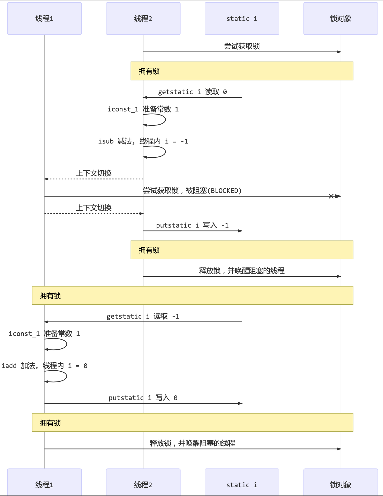

<!-- TOC -->

- [1. synchronized 关键字](#1-synchronized-关键字)
  - [1.1. 概述](#11-概述)
    - [1.1.1. 互斥和同步的细节](#111-互斥和同步的细节)
  - [1.2. 语法](#12-语法)
    - [1.2.1. 解决上一节中的共享问题](#121-解决上一节中的共享问题)
    - [1.2.2. 代码分析](#122-代码分析)
  - [1.3. 总结](#13-总结)
    - [1.3.1. 附加思考](#131-附加思考)
    - [1.3.2. 代码优化](#132-代码优化)
  - [1.4. 方法上的 synchronized](#14-方法上的-synchronized)

<!-- /TOC -->

## 1. synchronized 关键字

### 1.1. 概述
- synchronized 即俗称的`对象锁`, 它采用互斥的方式让同一时刻至多只有一个线程能持有`对象锁`, 其它线程再想获取这个`对象锁`时就会阻塞住.   
- 这样就能保证拥有锁的线程可以安全的执行临界区内的代码, 不用担心线程上下文切换.

#### 1.1.1. 互斥和同步的细节
- 虽然 java 中互斥和同步都可以采用 synchronized 关键字来完成, 但它们还是有区别的:
  - 互斥是保证临界区的竞态条件发生, 同一时刻只能有一个线程执行临界区代码;
  - 同步是由于线程执行的先后、顺序不同、需要一个线程等待其它线程运行到某个点.

### 1.2. 语法
- synchronized 只能用在方法和代码块上, 因为它要保证的是临界区代码执行的原子性.
- 语法示例
    ```java
    synchronized(对象) // 线程 1 (running),  线程 2(blocked) 
    {
        // 临界区
    }
    ```

#### 1.2.1. 解决上一节中的共享问题
- 代码示例:  
    ```java
    static int counter = 0;
    static final Object room = new Object();
    public static void main(String[] args) throws InterruptedException { 
        Thread t1 = new Thread(() -> {
            for (int i = 0; i < 5000; i++) { 
                synchronized (room) {
                    counter++; 
                }
            }
        }, "t1");

        Thread t2 = new Thread(() -> {
            for (int i = 0; i < 5000; i++) {
                synchronized (room) { 
                    counter--;
                } 
            }
        }, "t2");

        t1.start();
        t2.start();
        t1.join();
        t2.join(); 
        
        log.debug("{}",counter);
    }
    ```

#### 1.2.2. 代码分析
- 图例:  
    
- 可以做这样的类比:
  - `synchronized(对象)` 中的对象, 可以想象为一个房间(room), 有唯一入口(门)房间只能一次进入一人进行计算, 线程 t1, t2 想象成两个人.
  - 当线程 t1 执行到 `synchronized(room)` 时就好比 t1 进入了这个房间, 并锁住了门拿走了钥匙, 在门内执行 `count++` 代码.
  - 这时候如果 t2 也运行到了 `synchronized(room)` 时, 它发现门被锁住了, 只能在门外等待, 发生了上下文切换, 阻塞住了.
  - 这中间即使 t1 的 CPU 时间片不幸用完, 被踢出了门外(不要错误理解为锁住了对象就能一直执行下去哦), 这时门还是锁住的,   
    t1 仍拿着钥匙, t2 线程还在阻塞状态进不来, 只有下次轮到 t1 自己再次获得时间片时才能开门进入.
  - 当 t1 执行完 `synchronized{}` 块内的代码, 这时候才会从 obj 房间出来并解开门上的锁, 唤醒 t2 线程把钥匙给他.    
    t2 线程这时才可以进入 obj 房间, 锁住了门拿上钥匙, 执行它的 `count--` 代码.

- 图例所示:  


### 1.3. 总结
- synchronized 实际是用对象锁保证了临界区内代码的原子性, 临界区内的代码对外是不可分割的, 不会被线程切换所打断.

#### 1.3.1. 附加思考
- 如果把 `synchronized(obj)` 放在 for 循环的外面, 如何理解?
  - 由于会保证临界区的代码执行的原子性, 因此会在整个 for 循环执行完后才释放锁对象.
  
- 如果 t1 `synchronized(obj1)` 而 t2 `synchronized(obj2)` 会怎样运作?
  - 锁对象不一样, 各走各的, 相当于没有上锁, 还是会出现竞态条件.
  
- 如果 t1 `synchronized(obj)` 而 t2 没有加会怎么样? 如何理解?
  - 同上.

#### 1.3.2. 代码优化
- 可以将需要保护的共享变量封装到同一个类中, 然后新建这个类的对象, 直接将其作为锁对象.
    ```java
    class Room {
        int value = 0;
        public void increment() {
            synchronized (this) {
                value++; 
            }
        }
        public void decrement() { 
            synchronized (this) {
                value--; 
            }
        }
        public int get() { 
            synchronized (this) {
                return value; 
            }
        } 
    }

    @Slf4j
    public class Test1 {
        public static void main(String[] args) throws InterruptedException { 
            Room room = new Room();
            Thread t1 = new Thread(() -> {
                for (int j = 0; j < 5000; j++) { 
                    room.increment();
                }
            }, "t1");

            Thread t2 = new Thread(() -> {
                for (int j = 0; j < 5000; j++) {
                    room.decrement(); 
                }
            }, "t2"); 
            
            t1.start(); 
            t2.start();
            t1.join();
            t2.join();
            
            log.debug("count: {}" , room.get());
        } 
    }
    ```

### 1.4. 方法上的 synchronized
- 放在类中的成员方法上
    ```java
    class Test{
        public synchronized void test() { } 
    }
    // 等价于
    class Test{
        public void test() {
            synchronized(this) { }
        } 
    }
    ```

- 放在静态方法上
    ```java
    class Test{
        public synchronized static void test() { } 
    }
    // 等价于
    class Test{
        public static void test() {
            synchronized(Test.class) { }
        } 
    }
    ```