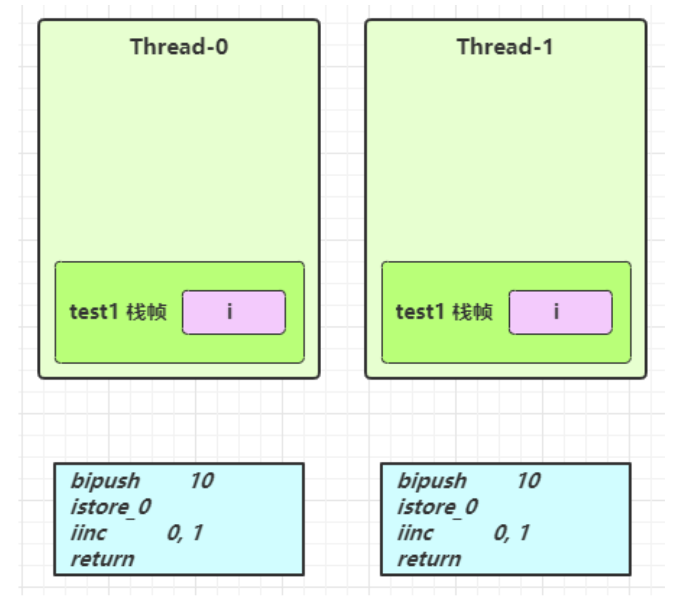
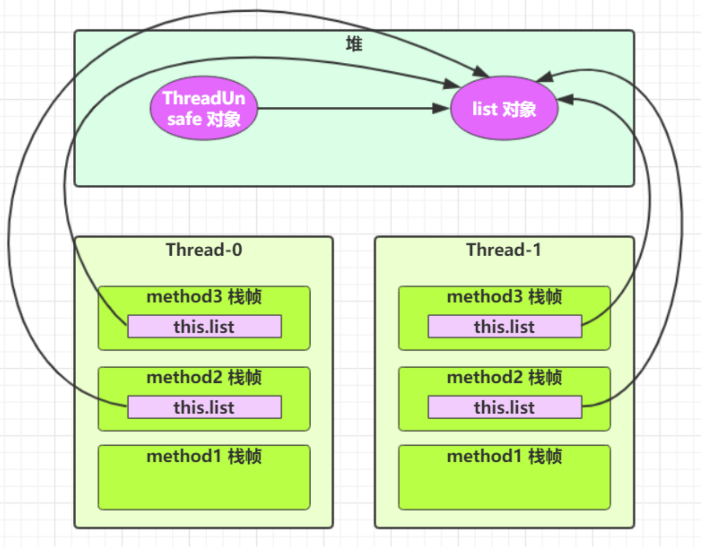

<!-- TOC -->

- [1. 变量的线程安全分析](#1-变量的线程安全分析)
  - [1.1. 成员变量和静态变量是否线程安全](#11-成员变量和静态变量是否线程安全)
  - [1.2. 局部变量是否线程安全](#12-局部变量是否线程安全)
  - [1.3. 局部变量线程安全分析](#13-局部变量线程安全分析)
    - [1.3.1. 实例 1](#131-实例-1)
    - [1.3.2. 实例 2](#132-实例-2)

<!-- /TOC -->

## 1. 变量的线程安全分析

### 1.1. 成员变量和静态变量是否线程安全
- 如果它们没有共享, 则线程安全
- 如果它们被共享了, 根据它们的状态是否能够改变, 又分两种情况
  - 如果只有读操作, 则线程安全
  - 如果有读写操作, 则这段代码是临界区, 需要考虑线程安全

### 1.2. 局部变量是否线程安全
- 局部变量是线程安全的
- 但局部变量引用的对象则未必
  - 如果该对象没有逃离方法的作用访问, 它是线程安全的
  - 如果该对象逃离方法的作用范围, 需要考虑线程安全

### 1.3. 局部变量线程安全分析

#### 1.3.1. 实例 1
- 代码如下:  
    ```java
    public static void test1() { 
        int i = 10;
        i++; 
    }
    ```

- 分析: 
  - 每个线程调用 `test1()` 方法时局部变量 i, 会在每个线程的栈帧内存中被创建多份, 因此不存在共享
  - 如下图所示:  
    

#### 1.3.2. 实例 2
- 代码如下:  
    ```java
    class ThreadUnsafe {
        ArrayList<String> list = new ArrayList<>(); 
        public void method1(int loopNumber) {
            for (int i = 0; i < loopNumber; i++) { 
                // { 临界区, 会产生竞态条件 method2();
                method3();
                // } 临界区 
            }
        }
        private void method2() { 
            list.add("1");
        }
        private void method3() { 
            list.remove(0);
        } 
    }

    static final int THREAD_NUMBER = 2; 
    static final int LOOP_NUMBER = 200; 
    public static void main(String[] args) {
        ThreadUnsafe test = new ThreadUnsafe(); 
        for (int i = 0; i < THREAD_NUMBER; i++) {
            new Thread(() -> { 
                test.method1(LOOP_NUMBER);
            }, "Thread" + i).start(); 
        }
    }
    ```

- 分析:  
  - 其中一种情况是, 如果线程2 还未 add, 线程1 remove 就会报错:  
    `Exception in thread "Thread1" java.lang.IndexOutOfBoundsException: Index: 0, Size: 0`
  - 无论哪个线程中的 method2/3 引用的都是同一个对象中的 list 成员变量
  - 如下所示:  
    

- 修正:  
  - 代码如下 
    ```java
    class ThreadSafe {
        public final void method1(int loopNumber) {
            ArrayList<String> list = new ArrayList<>(); 
            for (int i = 0; i < loopNumber; i++) {
                method2(list);
                method3(list); 
            }
        }
        private void method2(ArrayList<String> list) { 
            list.add("1");
        }
        private void method3(ArrayList<String> list) { 
            list.remove(0);
        } 
    }
    ```
  - 分析: 这样每次调用 method1 都会新生成一个局部变量, 所以每个线程的 list 都是不一样的.