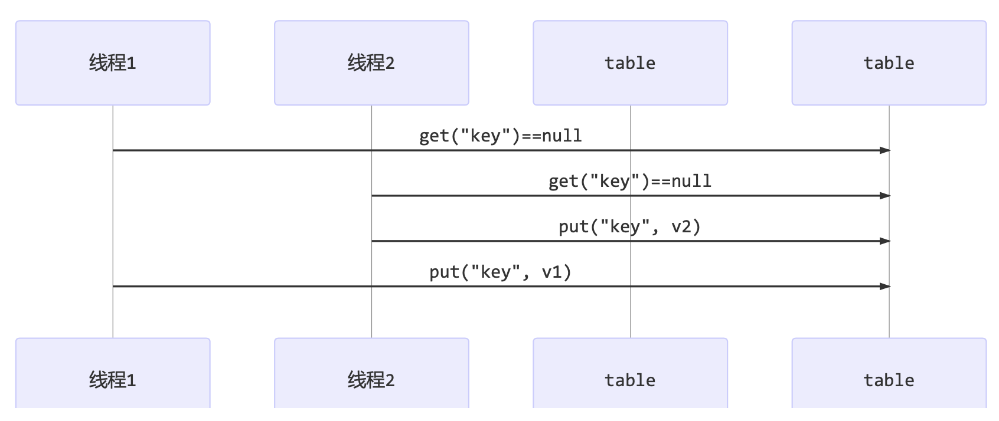

<!-- TOC -->

- [1. 常见线程安全类](#1-常见线程安全类)
  - [1.1. 常见的线程安全类如下](#11-常见的线程安全类如下)
    - [1.1.1. 分析](#111-分析)
    - [1.1.2. 线程安全类方法的组合](#112-线程安全类方法的组合)
  - [1.2. 不可变类线程安全性](#12-不可变类线程安全性)

<!-- /TOC -->

## 1. 常见线程安全类

### 1.1. 常见的线程安全类如下
  - String
  - Integer
  - StringBuffer
  - Random
  - Vector
  - Hashtable 
  - java.util.concurrent 包下的类

#### 1.1.1. 分析
- 这里说它们是线程安全的是指, 多个线程调用它们同一个实例的某个方法时, 是线程安全的. 也可以理解为:  
  - 它们的每个方法是原子的
  - 但注意它们多个方法的组合不是原子的, 见后面分析.

#### 1.1.2. 线程安全类方法的组合
- 分析下面代码是否线程安全?
    ```java
    Hashtable table = new Hashtable(); 
    // 线程1, 线程2
    if( table.get("key") == null) {
        table.put("key", value); 
    }
    ```

- 分析: 线程并不安全, 因为这两个操作并非原子操作, 操作之间会受到其它线程影响, 如下所示:  
  

### 1.2. 不可变类线程安全性
- String、Integer 等都是不可变类, 因为其内部的状态不可以改变, 因此它们的方法都是线程安全的.
- 有同学或许有疑问, String 有 replace, substring 等方法可以改变值啊, 那么这些方法又是如何保证线程安全的呢?
  - 以 substring 为例, 它的返回值是一个新的字符串, 和原字符串无关.
  - 只是对原有字符串内容复制, 并没有改变原字符串的值, 因此线程安全.