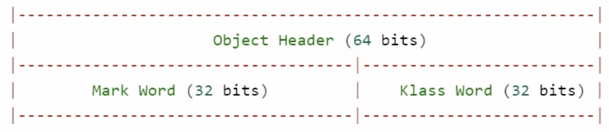
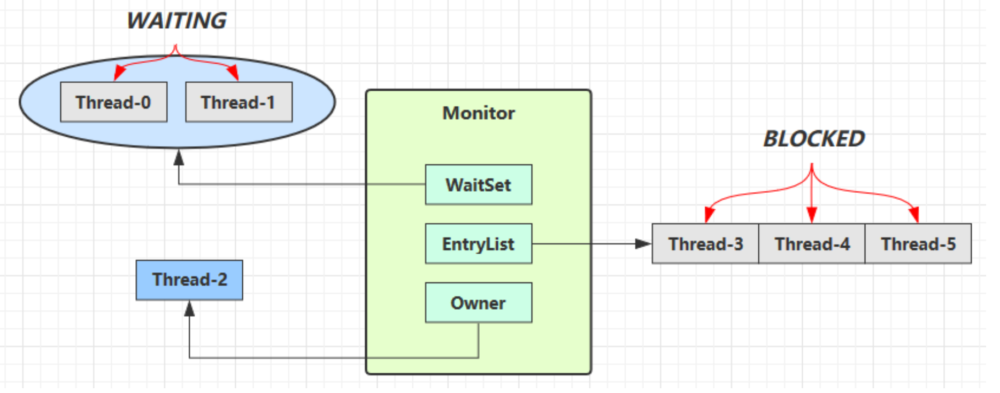

<!-- TOC -->

- [1. Monitor 的概念](#1-monitor-的概念)
  - [1.1. JAVA 对象头](#11-java-对象头)
    - [1.1.1. MarkWord 的结构](#111-markword-的结构)
  - [1.2. Monitor(锁)](#12-monitor锁)
    - [1.2.1. Monitor 的结构](#121-monitor-的结构)

<!-- /TOC -->

## 1. Monitor 的概念

### 1.1. JAVA 对象头
- 普通对象的对象头, 分为两部分, MarkWord 和 KlassWord 
  
  - KlassWord 则是存储了这个对象所对应的类的信息
  - MarkWord 则存储了更多的信息, 后面会讲解
  

- 数组对象的对象头, 分为三部分  
  
  - 数组对象的对象头则多了一个数组长度的存储信息

#### 1.1.1. MarkWord 的结构
- 结构如下所示, 根据对象的状态分为 5 种结构  
  

- 其中在正常状态 Normal 下: 
  - 每个对象都有一个独一无二的 hashcode
  - age 则是垃圾回收时的分代年龄
  - biased_lock 代表偏向锁, 后一位则代表加锁状态

### 1.2. Monitor(锁)
- Monitor 被翻译为监视器或管程
- 每个 Java 对象都可以关联一个 Monitor 对象, 使用 synchronized 给对象上锁(重量级)后,   
  该对象头的 Mark Word 中就被设置指向 Monitor 对象的指针.

#### 1.2.1. Monitor 的结构
- Monitor 结构如下  
    

- 上图过程分析:  
  - 刚开始的时候 Monitor 中 `Owner` 为 null
  
  - 当 Thread-2 抢到 CPU 时间, 然后执行 `synchronized(obj)` 时, 就会将 Monitor 的所有者 `Owner` 置为 Thread-2, Monitor 只能有一个 `Owner`
  
  - 在 Thread-2 上锁的过程中, 如果 Thread-3, Thread-4, Thread-5 也来执行 `synchronized(obj)`, 就会进入 `EntryList`, 线程此时则进入了 `BLOCKED` 状态.
  
  - Thread-2 执行完同步代码块的内容, 然后唤醒 `EntryList` 中等待的线程来竞争锁, 竞争的时是非公平的, 即不管线程进入等待队列的顺序, 当锁被释放的时候, 等待队列的所有线程都会被唤醒来抢这个锁.
  
  - 图中 `WaitSet` 中的 Thread-0, Thread-1 则是之前获得过锁, 但条件不满足, 然后进入 `WAITING` 状态的线程, 后面讲 wait-notify 时会分析.

- 注意:  
  - synchronized 必须是进入同一个对象的 monitor 才有上述的效果
  - 不加 synchronized 的对象不会关联监视器, 不遵从以上规则