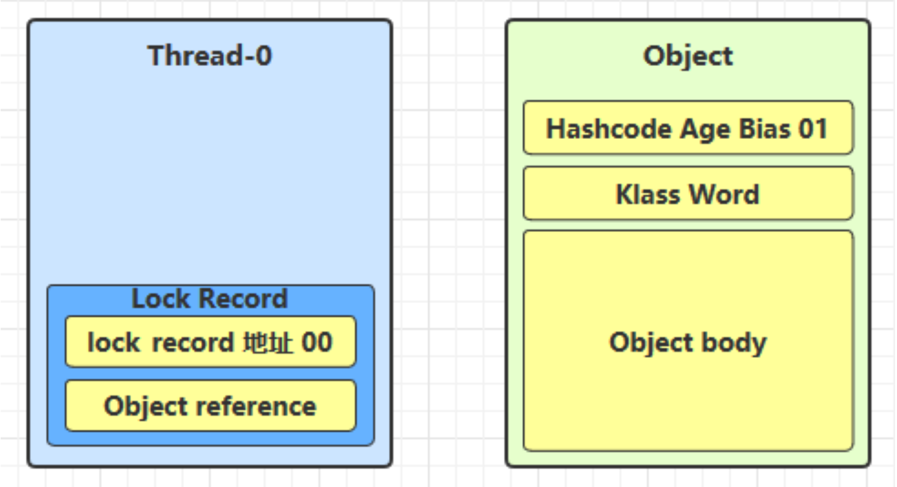
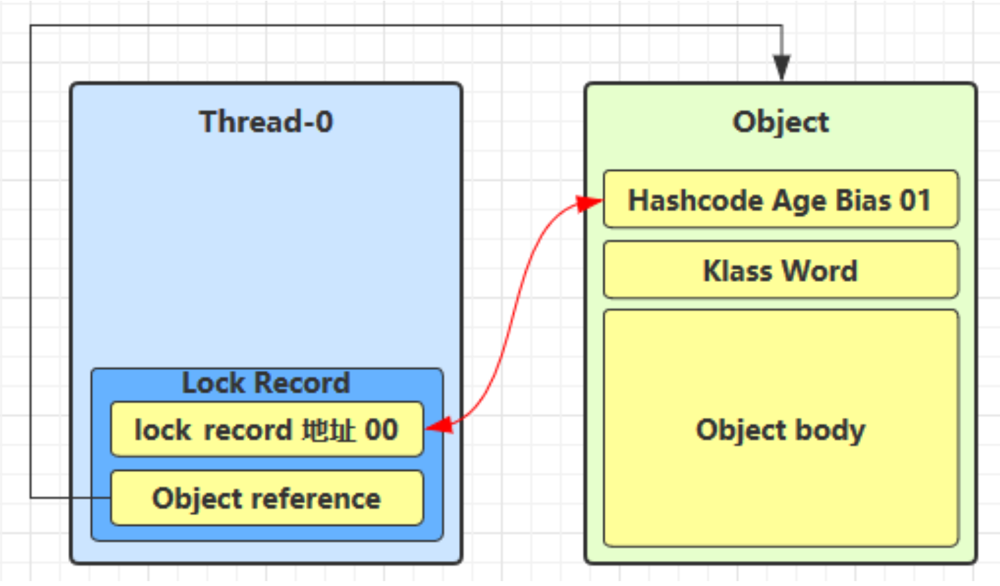
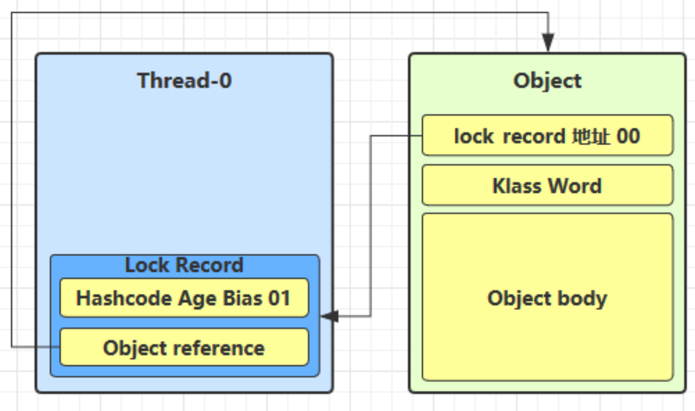
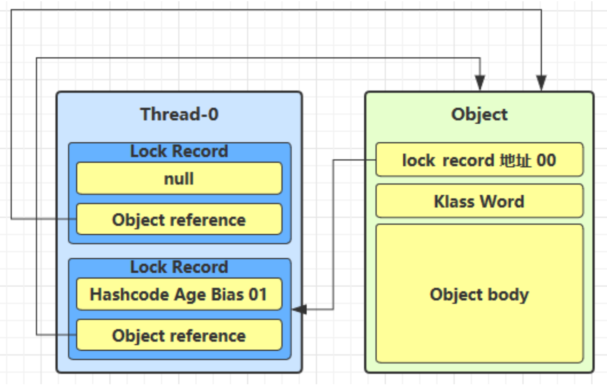
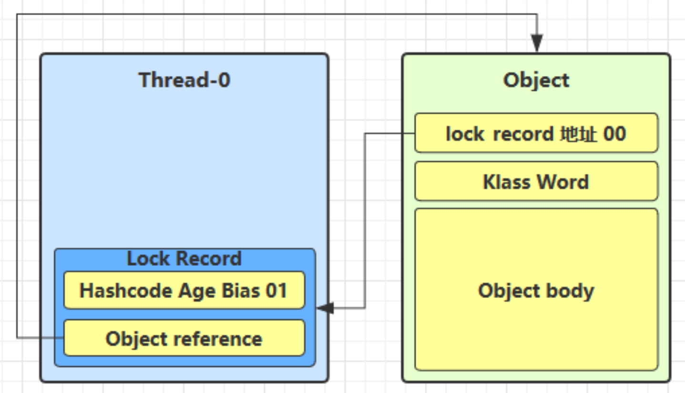
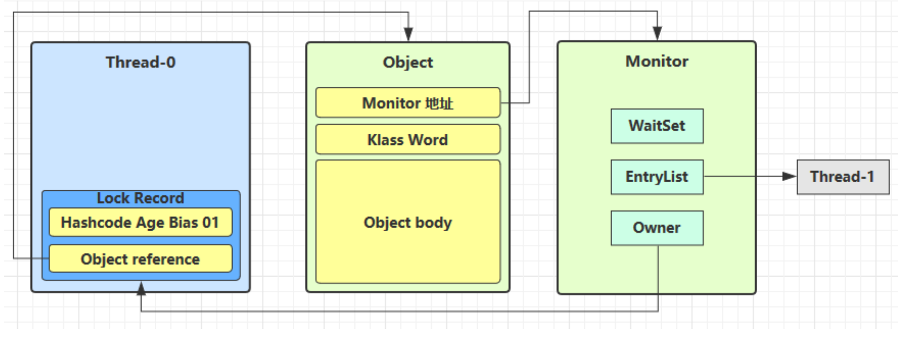
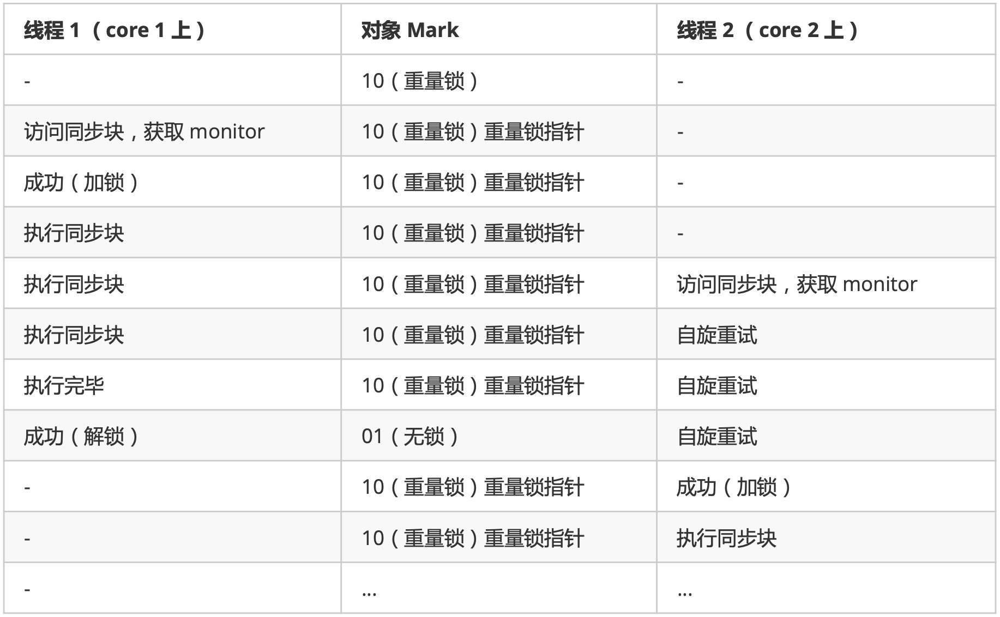
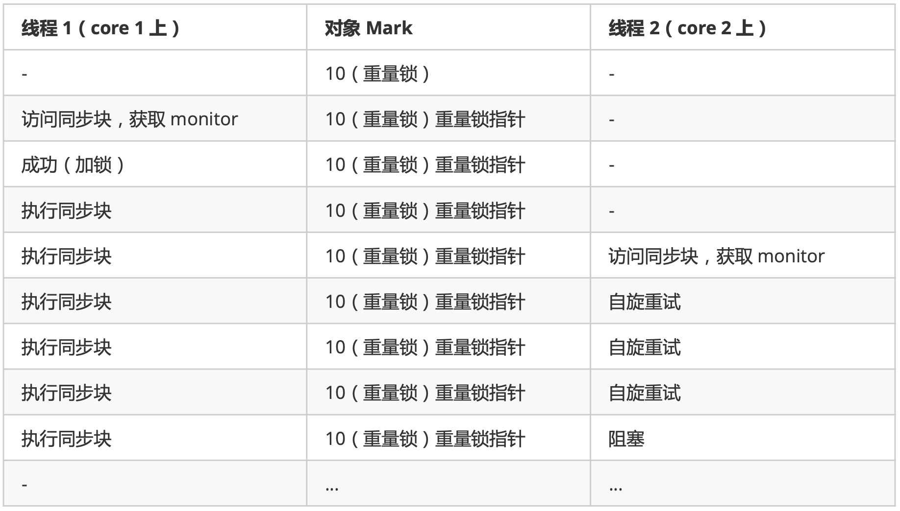

<!-- TOC -->

- [1. synchronized 原理进阶](#1-synchronized-原理进阶)
  - [1.1. 轻量级锁](#11-轻量级锁)
    - [1.1.1. 代码实例](#111-代码实例)
    - [1.1.2. 实例解析](#112-实例解析)
  - [1.2. 锁膨胀](#12-锁膨胀)
    - [1.2.1. 代码实例](#121-代码实例)
    - [1.2.2. 过程图解](#122-过程图解)
  - [1.3. 自旋优化](#13-自旋优化)
    - [1.3.1. 自旋重试成功的情况](#131-自旋重试成功的情况)
    - [1.3.2. 自旋重试失败的情况](#132-自旋重试失败的情况)
    - [1.3.3. 注意](#133-注意)

<!-- /TOC -->

## 1. synchronized 原理进阶

### 1.1. 轻量级锁
- 轻量级锁的使用场景: 如果一个对象虽然有多线程要加锁, 但加锁的时间是错开的(也就是没有竞争), 那么可以
使用轻量级锁来优化. 

- 轻量级锁对使用者是透明的, 即语法仍然是 `synchronized`, 只是调用时会优先使用轻量级锁, 要是加锁失败, 则会改为使用重量级锁.

#### 1.1.1. 代码实例
- 假设有两个方法同步块, 利用同一个对象加锁
    ```java
    static final Object obj = new Object(); 
    public static void method1() {
        synchronized( obj ) { 
            // 同步块 A
            method2(); 
        }
    }
    public static void method2() {
        synchronized( obj ) { 
            // 同步块 B
        } 
    }
    ```

#### 1.1.2. 实例解析
- 当 method1 运行到 `synchronized` 时, 创建锁记录(Lock Record)对象, 每个线程都的栈帧都会包含一个锁记录的结构, 内部可以存储锁定对象的 Mark Word.  
  

- 然后让锁记录中 Object reference 指向锁对象, 并尝试用 cas 替换 Object 的 Mark Word, 将 Mark Word 的值存入锁记录, 然后锁记录地址和状态的值则存入对象的 Mark Word 中, 相当于进行一次值互换.  
  

- 如果 cas 替换成功, 对象头中存储了锁记录地址和状态 00 , 表示由该线程给对象加锁, 这时图示如下  
  

- 如果 cas 替换失败, 则可能有两种情况:  
  - 如果是其它线程已经持有了该 Object 的轻量级锁, 即 Mark Word 中的锁状态已经是 00 了, 这时表明有竞争, 则进入锁膨胀过程
  - 如果是自己执行了 synchronized 锁重入, 那么再添加一条 Lock Record 作为重入的计数, 这里对应的是 method1 中调用 method2 后再次进入同一对象的 synchronized 加锁, 如下图所示  
    

- 当退出 synchronized 代码块(解锁时)如果有取值为 null 的锁记录, 表示有重入, 这时重置锁记录, 表示重 入计数减一, 这里对应的是 method2 中的临界区执行完后释放锁.  
  

- 当退出 synchronized 代码块(解锁时)锁记录的值不为 null, 这时使用 cas 替换将 Mark Word 的值恢复给对象头
  - 成功, 则解锁成功
  - 失败, 说明轻量级锁进行了锁膨胀或已经升级为重量级锁, 则进入重量级锁解锁流程

### 1.2. 锁膨胀
- 如果在尝试加轻量级锁的过程中, CAS 操作无法成功, 这时一种情况就是有其它线程为此对象加上了轻量级锁(有
竞争), 这时需要进行锁膨胀, 将轻量级锁变为重量级锁. 

#### 1.2.1. 代码实例
- 如下所示  
    ```java
    static Object obj = new Object(); 
    public static void method1() {
        synchronized( obj ) { 
            // 同步块
        } 
    }
    ```

#### 1.2.2. 过程图解
- 当 Thread-1 进行轻量级加锁时, Thread-0 已经对该对象加了轻量级锁  
  

- 这时 Thread-1 加轻量级锁失败, 进入锁膨胀流程:
  
  - 即为 Object 对象申请 Monitor 锁, 让 Object 指向重量级锁地址
  - 然后自己进入 Monitor 的 EntryList, 线程进入 BLOCKED 状态

- 当 Thread-0 退出同步块解锁时, 会尝试使用 cas 将 Mark Word 的值恢复给对象头, 但会操作失败. 
- 这时会进入重量级解锁流程, 即按照 Monitor 地址找到 Monitor 对象, 设置 Owner 为 null, 唤醒 EntryList 中的 BLOCKED 线程

### 1.3. 自旋优化
- 重量级锁竞争的时候, 还可以使用自旋(即不会立刻进入阻塞状态, 而是重试几次获取锁)来进行优化.  
- 如果当前线程自旋成功(即这时候持锁线程已经退出了同步块, 释放了锁), 这时当前线程就可以避免进入阻塞.

#### 1.3.1. 自旋重试成功的情况
- 如下过程所示  
  

#### 1.3.2. 自旋重试失败的情况
- 如下过程所示
  

#### 1.3.3. 注意
- 自旋会占用 CPU 时间, 单核 CPU 自旋就是浪费, 多核 CPU 自旋才能发挥优势.
- 在 Java 6 之后自旋锁是自适应的. 
  - 比如对象刚刚的一次自旋操作成功过, 那么就会认为这次自旋成功的可能性会高, 会多自旋几次; 
  - 反之, 就少自旋甚至不自旋, 总之, 比较智能.
- Java 7 之后不能控制是否开启自旋功能.