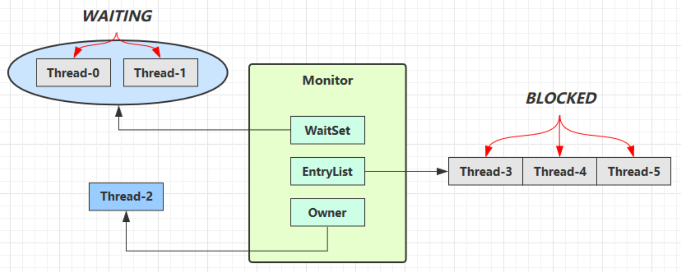

<!-- TOC -->

- [1. wait-notify 的原理](#1-wait-notify-的原理)
  - [1.1. 原理](#11-原理)
  - [1.2. API 介绍](#12-api-介绍)
    - [1.2.1. 实例](#121-实例)
  - [1.3. sleep(long n) 和 wait(long n) 的异同](#13-sleeplong-n-和-waitlong-n-的异同)

<!-- /TOC -->

## 1. wait-notify 的原理

### 1.1. 原理
- 如下图所示:  
  

- Owner 线程发现条件不满足, 调用 wait 方法, 即可进入 WaitSet 变为 WAITING 状态
- BLOCKED 和 WAITING 的线程都处于阻塞状态, 不占用 CPU 时间片
- BLOCKED 线程会在 Owner 线程释放锁时唤醒
- WAITING 线程会在 Owner 线程调用 notify 或 notifyAll 时唤醒, 但唤醒后并不意味者立刻获得锁, 仍需进入 EntryList 重新竞争

### 1.2. API 介绍
- `obj.wait()` 让进入 object 监视器的线程到 waitSet 等待 
- `obj.wait(long n)` 让进入 object 监视器的线程到 waitSet 等待指定的时间, 若期间被唤醒, 则停止等待 
- `obj.notify()` 在 object 上正在 waitSet 等待的线程中挑一个唤醒 
- `obj.notifyAll()` 让 object 上正在 waitSet 等待的线程全部唤醒

#### 1.2.1. 实例
- 它们都是线程之间进行协作的手段, 都属于 Object 对象的方法。必须获得此对象的锁, 才能调用这几个方法
  ```java
  final static Object obj = new Object(); 
  public static void main(String[] args) {
    new Thread(() -> { 
      synchronized (obj) {
        log.debug("执行...."); 
        try {
          obj.wait(); // 让线程在obj上一直等待下去 
        } catch (InterruptedException e) {
          e.printStackTrace(); 
        }
        log.debug("其它代码...."); 
      }
    }).start();

    new Thread(() -> { 
      synchronized (obj) {
        log.debug("执行...."); 
        try {
          obj.wait(); // 让线程在obj上一直等待下去 
        } catch (InterruptedException e) {
          e.printStackTrace(); 
        }
        log.debug("其它代码...."); 
      }
    }).start();

    // 主线程两秒后执行
    sleep(2);
    log.debug("唤醒 obj 上其它线程"); 
    synchronized (obj) {
      obj.notify(); // 唤醒obj上一个线程
      // obj.notifyAll(); // 唤醒obj上所有等待线程 
    }
  }
  ```

- notify 的结果
  ```java
  20:00:53.096 [Thread-0] c.TestWaitNotify - 执行.... 
  20:00:53.099 [Thread-1] c.TestWaitNotify - 执行.... 
  20:00:55.096 [main] c.TestWaitNotify - 唤醒 obj 上其它线程 
  20:00:55.096 [Thread-0] c.TestWaitNotify - 其它代码....
  ```

- notifyAll 的结果
  ```java
  19:58:15.457 [Thread-0] c.TestWaitNotify - 执行.... 
  19:58:15.460 [Thread-1] c.TestWaitNotify - 执行.... 
  19:58:17.456 [main] c.TestWaitNotify - 唤醒 obj 上其它线程 
  19:58:17.456 [Thread-1] c.TestWaitNotify - 其它代码.... 
  19:58:17.456 [Thread-0] c.TestWaitNotify - 其它代码....
  ```

### 1.3. sleep(long n) 和 wait(long n) 的异同
- 不同之处:  
  - sleep 是 Thread 方法, 而 wait 是 Object 的方法. 
  - sleep 不需要强制和 synchronized 配合使用, 但 wait 需要 和 synchronized 一起用. 
  - sleep 在睡眠的时候不会释放对象锁; 但 wait 在等待的时候会释放对象锁.
- 相同之处:  
  - 它们状态都是 TIMED_WAITING